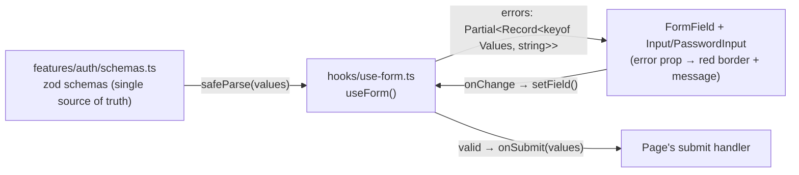

# The PetZu World — Authentication & Dashboard

Seventh milestone. Auth screens and a signed-in dashboard on top of the
foundation ([ARCHITECTURE.md](ARCHITECTURE.md)), design system
([DESIGN_SYSTEM.md](DESIGN_SYSTEM.md)), and the store/services/content
modules ([STORE.md](STORE.md), [SERVICES.md](SERVICES.md),
[CONTENT.md](CONTENT.md)).

**No backend integration.** Nothing here authenticates anything: "login"
accepts any well-formed credentials and writes a session to
`localStorage`. Every place that matters, this is stated plainly in the UI
rather than mimicked convincingly — see §8 for exactly what changes when a
real backend arrives.

---

## 1. Why this authentication flow?

```
Sign up → OTP verify → Dashboard
Sign in ─────────────→ Dashboard
Sign in → Forgot password → (email sent) → back to Sign in
```

- **Signup routes through OTP verification, sign-in doesn't.** Email
  verification exists to prove you own the address you just claimed —
  that's a one-time concern at account creation, not something to re-ask
  on every return visit. Making returning users clear an OTP they don't
  need is the single most common way products make sign-in feel hostile.
- **Forgot-password resolves in place, not on a new route.** After
  submitting an email there's nothing left to *do* on the next screen
  except read one sentence — so the success state replaces the form
  inside the same card. A navigation would add a page load and a back-
  button trap for zero informational gain.
- **The OTP screen has a resend timer, not a bare resend link.** An
  always-available resend invites double-sends (and, with a real backend,
  rate-limit lockouts); a 30-second countdown sets the expectation that
  the first email is probably still coming.
- **Social buttons are honest about being inert.** Real OAuth needs a
  real backend. Rather than render dead buttons or fake a redirect, they
  show a toast explaining this milestone is frontend-only. A button that
  silently does nothing is a worse lie than one that says so.

## 2. Why these forms?

- **Errors appear on submit, and clear on edit.** Validating every field
  on every keystroke means telling someone their email is invalid while
  they're still typing the `@` — technically true, practically hostile.
  Validating on submit surfaces everything at once; clearing a field's
  error the moment it's edited (`setField` in
  [hooks/use-form.ts](hooks/use-form.ts)) gives immediate feedback that
  the fix registered.
- **One error message per field, not a stacked list.** `useForm` keeps
  only the *first* issue per field. Showing "must be 8 characters" and
  "needs an uppercase letter" and "needs a number" simultaneously is
  noise; fixing the first usually surfaces the next naturally.
- **Password strength is a meter, not a gate.** The signup form shows a
  four-segment strength bar via
  [`getPasswordStrength`](features/auth/utils.ts), but only the schema's
  actual rules block submission. Strength meters that *enforce* an
  arbitrary score frustrate people using long passphrases, which are
  strong precisely because they don't look like `P@ssw0rd!`.
- **Every password field has a visibility toggle.** Typing a password
  blind on a phone keyboard is the main reason people fall back to weak,
  easy-to-type passwords.
- **The OTP input behaves like one field, not six.** Type-to-advance,
  backspace-to-retreat, and — the one most implementations forget —
  pasting the whole 6-digit code fills all six boxes, because that's how
  people actually get a code out of an email.

## 3. Why this dashboard layout?

A persistent left rail with a flat, non-nested nav — the Notion/Linear
shape — chosen over a top-tab or hamburger-first layout for three reasons:

1. **It scales without redesign.** Seven items today; twenty would still
   fit vertically. Horizontal tab bars break at roughly six.
2. **Position is always visible.** The active item is highlighted at all
   times, so "where am I" never requires reading the URL or a breadcrumb.
3. **Content width stays honest.** With nav in a fixed rail, the content
   column keeps a consistent width across every page, so pages don't
   visually jump when navigating between them.

On mobile the same `DashboardNav` component moves into a `Sheet` — one
component, two containers, the same pattern used for filters in
[STORE.md](STORE.md) and [SERVICES.md](SERVICES.md).

**Every dashboard page opens with the same `PageHeader`** (title,
description, optional action) so the top-left corner means the same thing
on all seven pages. That consistency is most of what makes an app shell
feel "designed" rather than assembled.

## 4. Reusable form components

| Component | Job | Reused by |
|---|---|---|
| [`FormField`](components/ui/form-field.tsx) | Label + control + error/helper text with consistent spacing | Every form in the app (built back in the design-system milestone — unchanged here, which is the point) |
| [`PasswordInput`](features/auth/components/password-input.tsx) | Password field + visibility toggle + optional strength meter | Sign-in, sign-up (×2), settings password change (×3) |
| [`OtpInput`](features/auth/components/otp-input.tsx) | Six boxes behaving as one field | Verify page |
| [`AuthShell`](features/auth/components/auth-shell.tsx) | Centered glass card, logo, title/subtitle, footer slot | All four auth pages |
| [`SocialAuthButtons`](features/auth/components/social-auth-buttons.tsx) / [`AuthDivider`](features/auth/components/auth-divider.tsx) | OAuth row + "or continue with email" rule | Sign-in, sign-up |
| [`AccountMenu`](features/auth/components/account-menu.tsx) | Sign-in link when logged out, avatar dropdown when logged in | Navbar (desktop + mobile) |
| [`EmptyState`](components/ui/empty-state.tsx) | Icon + title + description + optional action, `empty`/`error` tones | Pets, orders, appointments, notifications |
| [`PageHeader`](features/dashboard/components/page-header.tsx) | Consistent page title block | All 7 dashboard pages |

Two genuinely new **design-system** primitives were added this milestone
(`DropdownMenu`, `EmptyState`) — both placed in `components/ui/`, not
`features/auth/`, because neither is auth-specific.

## 5. Validation architecture



**Why zod + a ~40-line hook instead of react-hook-form.** Zod already
solves the genuinely hard part (composable, typed validation rules —
including cross-field checks like "passwords must match" via `.refine()`).
What's left is holding values in state and mapping issues onto fields,
which is small enough that a form library's extra API surface and bundle
cost isn't justified for forms of this size. If this app later grew field
arrays or wizard-style multi-form state, that calculus would change.

**One notable type decision**: `useForm` types its schema against a
*structural* `ValidationSchema<Values>` interface rather than importing
zod's own generics. A bare `z.ZodType` generic infers `Values` as
`unknown` (which broke the build on first attempt — spreading `unknown`
isn't allowed); driving the generic from `initialValues` instead gives
full type safety on `values`, `errors`, and `setField`, and keeps the hook
independent of any one zod major version's generic signature.

**Validation rules live in exactly one place.** `passwordSchema` is
composed into both `signupSchema` and `passwordChangeSchema` — a rule
change applies to both automatically, with no chance of the signup form
and the settings form disagreeing about what a valid password is.

## 6. Empty states

Every list surface has one, and each does three things rather than just
announcing emptiness:

| Page | Says what's missing | Says why it matters | Offers the next action |
|---|---|---|---|
| Saved pets | "No pets saved yet" | "…so booking takes seconds, not minutes" | **Add a pet** |
| Orders | "No orders yet" | "…your first order will show up here" | **Start shopping** → `/shop` |
| Appointments | "No upcoming appointments" | "…book a vet visit or grooming session" | **Book an appointment** → `/services/vet-booking` |
| Notifications | "No notifications" | "…order updates and reminders show up here" | (none — nothing for the user to do) |

The pattern being avoided is the empty state that only says "Nothing
here" — which tells someone they're in the right place but stranded. Three
of the four route the user somewhere useful; notifications deliberately
doesn't, because there's no action a user can take to *cause* a
notification, and inventing a button there would be filler.

`EmptyState` also carries an `error` tone (destructive-tinted icon well)
so the same component covers failure states when a real backend can
actually fail.

## 7. Loading states

Three distinct kinds, deliberately not collapsed into one spinner:

1. **Route-level** — `app/dashboard/loading.tsx` renders `PageSkeleton`
   via Next's Suspense convention, shown during navigation between
   dashboard pages.
2. **Session-hydration** — `DashboardShell` renders
   `DashboardShellSkeleton` while `localStorage` is being read *and*
   during the brief window before the redirect fires for a signed-out
   visitor. This is why no private page chrome ever flashes to someone
   who isn't allowed to see it (verified: signed-out SSR of `/dashboard`
   contains none of the mock user's name, email, order references, or
   appointment data).
3. **In-form submitting** — every submit button swaps its label
   ("Sign in" → "Signing in…") and disables itself. Disabling matters as
   much as the label: it's what prevents double-submits, which with a real
   backend means duplicate accounts or duplicate charges.

Skeletons are shaped like the content they replace (sidebar rail, stat
grid, list rows) rather than being generic bars — a skeleton whose layout
matches the real page prevents the content jump that makes loading feel
slower than it is.

## 8. Future backend integration

The seams are already in the right places. What changes, file by file:

| File | Today | With a backend |
|---|---|---|
| [`features/auth/store.ts`](features/auth/store.ts) | `login()` writes a `localStorage` session | Calls `POST /auth/login`, stores an httpOnly cookie set by the server; the `useSession` public API is unchanged |
| Auth page submit handlers | `setTimeout` + `login(defaultUser)` | `await api.login(values)`, handle a `401` by setting a form-level error |
| [`features/auth/hooks.ts`](features/auth/hooks.ts) `useRequireAuth` | Client-side redirect | Replaced by **middleware** — see below |
| [`features/dashboard/constants.ts`](features/dashboard/constants.ts) | Static mock arrays | Server Components fetching real data; the page components consume the same shapes |
| [`features/auth/schemas.ts`](features/auth/schemas.ts) | Client validation only | **Reused verbatim** on the server — the single biggest payoff of putting rules in zod rather than in JSX |

**The one thing that must change, not just be swapped:** route protection.
Client-side `useRequireAuth` is the only option without a server session,
but it is **not** real security — `/dashboard` currently returns HTTP 200
to anyone, and only the *client* redirects. With a backend, protection
belongs in `middleware.ts` checking a session cookie before the route
renders at all, so an unauthenticated request never receives the page.
The client-side hook would remain as a defense-in-depth nicety, not the
gate.

What already behaves correctly today and wouldn't need changing: dashboard
pages are marked `robots: { index: false, follow: false }`, and the
signed-out server render leaks no user data (both verified).

## 9. Enterprise authentication architecture

How this compares to what a production system (Auth0, Okta, Clerk,
WorkOS) actually provides:

- **Present here, in spirit**: email/password with real validation rules,
  email verification via OTP, password reset initiation, session
  persistence, protected-route redirect, and account deletion.
- **Structurally ready but not implemented**: OAuth/social login (the UI
  slot exists; the flow needs a backend + provider registration), and
  rate limiting on OTP resend (the timer is a UX affordance today, not an
  enforced limit — enforcement has to live server-side, since anything
  client-side is trivially bypassed).
- **Genuinely absent**: MFA/TOTP beyond the signup OTP, session
  revocation and device management, refresh-token rotation, SSO/SAML for
  enterprise tenants, audit logging, RBAC, and anomaly detection. All of
  these are inherently server-side concerns — there is no honest frontend
  approximation of "revoke this session on another device."
- **The security posture difference worth stating plainly**: enterprise
  systems put the session in an httpOnly, Secure, SameSite cookie the
  client JS can't read, specifically so an XSS bug can't exfiltrate it.
  This milestone stores the session in `localStorage`, which JS *can*
  read — acceptable for a demo with no real credentials behind it, and
  exactly the thing to change first when a backend lands.

## 10. Notes

### Route map

```
/sign-in                  → Login
/sign-up                  → Signup (→ /verify)
/verify?email=…           → OTP verification
/forgot-password          → Password reset request (+ inline success state)

/dashboard                → Overview (stats, upcoming, activity)
/dashboard/pets           → Saved pets (add/remove, empty state)
/dashboard/orders         → Order history (empty state)
/dashboard/appointments   → Upcoming/past tabs, cancel action
/dashboard/notifications  → Read/unread, mark-all-read
/dashboard/profile        → Editable profile (writes to session)
/dashboard/settings       → Password change, notification prefs, danger zone
```

### Session state flow

```mermaid
flowchart TB
    subgraph store["features/auth/store.ts (module store + localStorage)"]
        session["session: { isAuthenticated, user }"]
    end

    signin["/sign-in submit"] -->|login(user)| session
    verify["/verify submit"] -->|login(user)| session
    profile["/dashboard/profile submit"] -->|updateUser(patch)| session
    menu["AccountMenu → Sign out"] -->|logout()| session
    danger["/dashboard/settings → Delete account"] -->|logout()| session

    session -->|useSession| Navbar["Navbar → AccountMenu"]
    session -->|useRequireAuth| Shell["DashboardShell (gate)"]
    session -->|useSession| Pages["Dashboard pages"]
```

Same `useSyncExternalStore` + `localStorage` pattern as the cart, wishlist,
and toast stores — chosen for the same reason: state read and written from
components with no shared ancestor, without wrapping the app in a provider
that re-renders everything on every change.

### Verification

`npm run build` and `npm run lint` pass clean across all **99 routes**.
Verified via direct HTTP request:

- All four auth pages server-render their correct content.
- All seven dashboard routes respond without server errors.
- `/dashboard` signed-out **leaks no private data** — the mock user's
  name, email, order references, and appointment details are all absent
  from the server-rendered HTML.
- Dashboard pages correctly emit `<meta name="robots" content="noindex, nofollow">`.

As with the previous milestones, full click-through of the interactive
flows (submitting forms, the OTP boxes advancing, the dropdown opening)
wasn't visually verified in this session due to the non-composited
browser-pane limitation documented in [STORE.md](STORE.md) — worth a pass
in a normal browser tab. **Sign in with any valid-looking email and any
password** to reach the dashboard; on the OTP screen, `000000` is wired as
the deliberate failure case so the error state is reachable.
