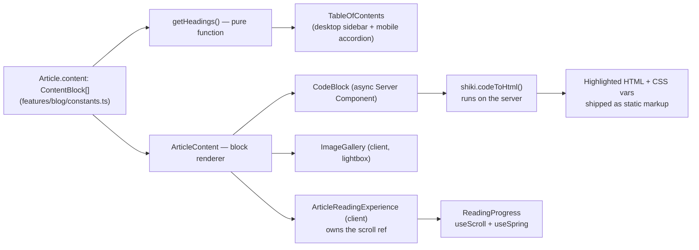
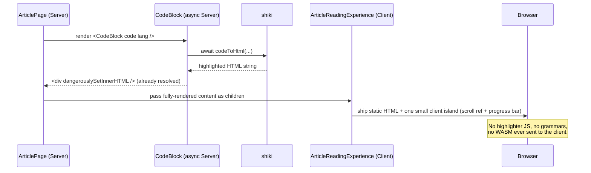

# The PetZu World — Content Experience

Sixth milestone. A full blog/reading system on top of the foundation
([ARCHITECTURE.md](ARCHITECTURE.md)), design system
([DESIGN_SYSTEM.md](DESIGN_SYSTEM.md)), homepage
([HOMEPAGE.md](HOMEPAGE.md)), store ([STORE.md](STORE.md)), and services
([SERVICES.md](SERVICES.md)). **Frontend only** — 7 articles, 4 authors,
server-side syntax highlighting via [shiki](https://shiki.style), and zero
new client-side JavaScript for anything that doesn't need it.

---

## 1. Why this blog architecture?

Content is authored as **structured block data** (`ContentBlock[]` —
paragraphs, headings, code, quotes, lists, galleries), not raw
markdown/HTML strings. That one decision drives most of what makes this
system nice to work with:

- **Every block type is a typed, reviewable shape.** A `heading` block
  can't be malformed HTML; a `code` block always has a real `language`
  field, which is what lets `CodeBlock` know what to hand shiki without
  parsing anything.
- **The table of contents is derived, not authored.** `getHeadings()` walks
  the same block array the article body renders from — there's no
  separate "TOC data" that can drift out of sync with the actual headings
  in the piece.
- **Read time is computed, not guessed.** `estimateReadTime()` counts
  words across every block type (weighting code lower, since code reads
  differently than prose) rather than a hardcoded "5 min read" someone
  forgets to update when they edit the piece.
- **FAQ lives in the same feature domain as the blog**, not a separate
  `features/faq/`. It's a deliberate scoping call: FAQ is ~15 lines of Q&A
  data with no logic of its own, and the milestone brief itself groups it
  under "Content Experience" — a whole new feature folder for one static
  page would be the kind of premature structure DESIGN_SYSTEM.md and
  STORE.md both explicitly avoid elsewhere in this project.

## 2. Why this typography?

No `.prose` stylesheet, no `@tailwindcss/typography` plugin — typography
is utility classes applied per block type in `ArticleContent`, the same
way every other surface in this codebase is styled (see
DESIGN_SYSTEM.md's typography-scale rationale). Specific choices:

- **`text-body-lg` (1.125rem) for body copy**, not the smaller default
  `text-body` — long-form reading benefits from a slightly larger size
  than UI chrome does; this is the same reasoning most serious reading
  products (Medium, Stripe Docs, Apple Newsroom) apply.
- **Relaxed leading, not default.** Comfortable line-height is the single
  highest-leverage typographic decision for long-form text — too tight and
  lines blur together on a re-read; too loose and paragraphs lose cohesion.
- **A measured line length** — the content column is capped at
  `max-w-[70ch]`, landing in the 65–75 character range typography
  research consistently identifies as the readability sweet spot,
  regardless of how wide the actual grid column is.
- **Fredoka for headings, Geist for body** — the same font pairing
  established in DESIGN_SYSTEM.md, carried into long-form content so an
  article doesn't feel like a different product from the rest of the site.
- **Scroll-margin on every heading** (`scroll-mt-28`) so clicking a TOC
  link or landing on a `#anchor` doesn't tuck the heading behind the
  sticky navbar + reading-progress bar.

## 3. Why this reading experience?

Every piece — progress bar, sticky TOC, generous type, the "on this page"
mobile accordion — exists to answer one question: **does the reader always
know where they are and how much is left?** That's the actual definition
of "excellent reading experience," more than any single visual flourish:

- The **progress bar** answers "how much is left" continuously, without
  requiring the reader to look at a scrollbar or guess.
- The **TOC** answers "where am I, and what's coming" — both as a
  navigation tool (jump to a section) and an orientation tool (the
  highlighted entry tells you your current position even if you never
  click it).
- **Syntax-highlighted code** with copy-to-clipboard removes the specific
  friction long-form technical content creates when code is unreadable or
  requires manual retyping.
- The **image gallery** lightbox keeps supplementary visuals from
  interrupting reading flow — thumbnails inline, full detail one click
  away, back to reading with one more.

## 4. Why sticky TOC?

A sticky right-rail TOC (desktop) keeps navigation available *without*
taking the reader's eyes off the content column — the alternative (TOC
only at the top of the article) means scrolling back up every time you
want to jump sections, which defeats the point of having a TOC at all for
anything longer than a few paragraphs.

It's **`position: sticky`, not `fixed`**, deliberately: sticky respects
the document flow, so the TOC scrolls normally until it reaches
`top-24`, then holds — it never floats over content that hasn't loaded
yet, and it naturally stops at the end of its own column instead of
overlapping the footer. `fixed` positioning would require manually
computing when to "release" it; `sticky` gets that for free from the
browser's layout engine.

**Active-section highlighting** is what makes a sticky TOC feel alive
rather than static — implemented via `IntersectionObserver` (not a scroll
listener recomputing on every pixel of scroll), which is both the more
accessible and more performant choice: the browser tells you exactly when
a heading crosses the "reading line," no manual scroll-position math, no
throttling to worry about.

## 5. Why progress indicator?

Placed at the very top of the viewport (`fixed top-0 z-[60]`, above even
the navbar) rather than integrated into the article header, because it
needs to stay visible and meaningful for the entire scroll — a progress
bar that scrolls away with the header stops being useful exactly when an
8-minute article most needs it (the middle, when "how much further" is
the actual live question).

It tracks scroll progress through **the article container specifically**
(`useScroll({ target: containerRef })`), not the whole page. If it tracked
whole-page scroll, the bar would hit 100% while the reader is still in the
related-articles section or the footer — a progress bar that lies about
being done is worse than no progress bar.

A `useSpring` wrapper around the raw scroll value is what keeps the bar
feeling fluid rather than jittery/discrete on fast scroll — same motion
token discipline as every other spring-driven value in this project (see
DESIGN_SYSTEM.md §8).

## 6. SEO decisions

- **Every route (listing, category, article, author, search) has its own
  `generateMetadata`**, not a single static title reused everywhere —
  search engines and social previews get the actual article title and
  excerpt, not "Blog | The PetZu World" fifteen times over.
- **Static generation for everything that can be.** All 7 articles, all 5
  categories, and all 4 author pages are prerendered at build time via
  `generateStaticParams` — fast, cacheable, crawlable HTML with no
  client-side data fetch standing between a crawler and the content.
- **Semantic HTML throughout**: `<h1>` once per article (the title),
  `<h2>`/`<h3>` for actual section structure (the same headings the TOC is
  built from — one hierarchy, not two), `<time dateTime={...}>` for
  publish dates, `<blockquote>`/`<cite>` for quotes, `<dl>`/`<dt>`/`<dd>`
  used correctly elsewhere in the app's booking flow and reused here in
  spirit.
- **Breadcrumbs on every content page** — both a UX aid and a structured
  navigational signal search engines use to understand site hierarchy
  (Home → Blog → Category → Article).
- **A real 404, not a soft one.** An invalid article/category/author slug
  calls `notFound()`, which Next.js resolves to an actual 404 response —
  not a "not found" *message* on a 200-status page, which search engines
  would otherwise index as real, thin content.

## 7. Responsive decisions

- **The TOC doesn't disappear on mobile — it relocates.** Below `lg`, the
  sticky sidebar is replaced by a collapsible "On this page" `Accordion`
  at the top of the article, using the *exact same* `TableOfContents`
  component (just `hideLabel` to avoid a redundant caption next to the
  accordion trigger that already says the same thing). One component, two
  presentations — not two implementations to keep in sync.
- **The reading column reflows, not just shrinks.** At `lg`+, content and
  TOC sit side by side (`grid-cols-[1fr_16rem]`); below that, it's a
  single column at full width. The `max-w-[70ch]` cap still applies on
  mobile, but a narrow viewport is already narrower than 70 characters at
  the sizes involved, so it degrades gracefully rather than needing a
  separate mobile rule.
- **The copy button is always visible below `sm`, hover-revealed above
  it** (`opacity-100 sm:opacity-0 sm:group-hover:opacity-100`) — the same
  lesson from the store's add-to-cart button (STORE.md §2): hover-only
  affordances are invisible on touch devices, so anything touch users
  need has to default to visible.
- **The image gallery grid is 3 columns regardless of viewport**, but
  each tile stays a perfect square (`aspect-square`) so it never distorts
  — the lightbox itself is full-width on mobile, capped on desktop.

## 8. Reusable article components

| Component | Reused by |
|---|---|
| `ArticleCard` / `ArticleGrid` | Blog listing, category pages, search, author profile, related-articles — every place a set of articles is shown |
| `AuthorByline` | `ArticleCard` (compact) and the article header (larger, linked) — one component, a `size` prop |
| `BlogListing` | Main listing, category pages, and search — identical search/paginate engine, different input `articles` array (same pattern as `ShopListing`/`ProviderListing` in the earlier milestones) |
| `TableOfContents` | Desktop sticky sidebar *and* the mobile accordion — see §7 |
| `CodeBlock` | Any article with a `code` block — self-contained, no article-specific wiring needed beyond passing `code`/`language`/`filename` |
| `ImageGallery` | Any article with a `gallery` block |
| `ArticleContent` | The one block-renderer every article page uses — swapping the content data doesn't require touching this component |
| `NewsletterCta` | Bottom of the blog listing and every article page |

The pattern holding all of it together is the same one established in
STORE.md and SERVICES.md: **one card component per content type**, driven
entirely by data, reused across every page that needs to show that type —
never a bespoke card per page.

## 9. Compared to Medium and Stripe Docs

- **Medium's reading-progress bar and clean single-column article
  layout** are the direct inspiration for this article page's overall
  shape — Medium proved that stripping almost everything except the text
  and a thin progress indicator is what makes long-form content feel
  calm rather than cluttered. This project follows that instinct but adds
  a sticky TOC Medium doesn't have, because PetZu's articles are
  structured/skimmable guides more often than personal essays — a TOC
  earns its keep here in a way it wouldn't on Medium's dominant content
  type.
- **Stripe Docs' code-block treatment is the direct model for `CodeBlock`**
  — server-rendered, theme-aware syntax highlighting with a copy button,
  no visible "loading" state for highlighting because there isn't one (it
  already happened on the server). Stripe's docs are widely considered
  best-in-class specifically because code never flashes unstyled or pops
  in after the page loads; this implementation gets that property for the
  same architectural reason Stripe's does — highlighting happens before
  the HTML ever reaches the browser.
- **Stripe Docs' persistent right-rail navigation** is the same
  `position: sticky` pattern used here, for the same reason: documentation
  and long-form guides both benefit from "where am I in this document"
  being answerable without scrolling.
- **Where this differs from both, deliberately**: Medium has no content
  categorization system as rigid as this project's category pages
  (Medium leans on tags and algorithmic feed instead); Stripe Docs has no
  concept of "author" as a public-facing identity the way this project's
  author profile pages do — PetZu's blog sits closer to a
  magazine/editorial model (bylines matter, categories matter) than
  either reference, which is why both are present here.

## 10. Notes

### Route map

```
/blog                              → Blog Listing (search, category pills, pagination)
/blog/category/[slug]              → Category (5 categories)
/blog/[slug]                       → Article Page (7 articles)
/blog/author/[slug]                → Author Profile (4 authors)
/blog/search                        → Search results
/faq                                → FAQ (4 categorized accordion sections)
```

### Content → rendering pipeline



### Why `CodeBlock` is async and `ArticleReadingExperience` is a client wrapper around it



### Verification

`npm run build` and `npm run lint` pass clean across all 88 routes. Every
route type's server-rendered HTML was verified via direct HTTP request,
including confirming shiki's dual-theme output is actually present in the
response (`class="shiki shiki-themes github-light github-dark"` plus
per-token `--shiki-light`/`--shiki-dark` CSS variables), and that an
invalid slug correctly renders a real 404. As with the previous three
milestones, full client-side interaction (scroll-spy highlighting, the
progress bar animating, the lightbox) wasn't visually verified in this
session due to the non-composited-browser-pane limitation documented in
[STORE.md](STORE.md) — worth a click-through in a normal browser tab.
