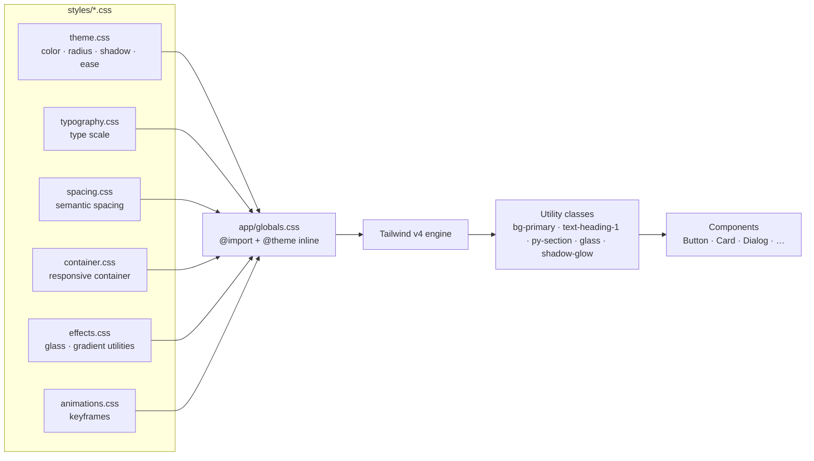
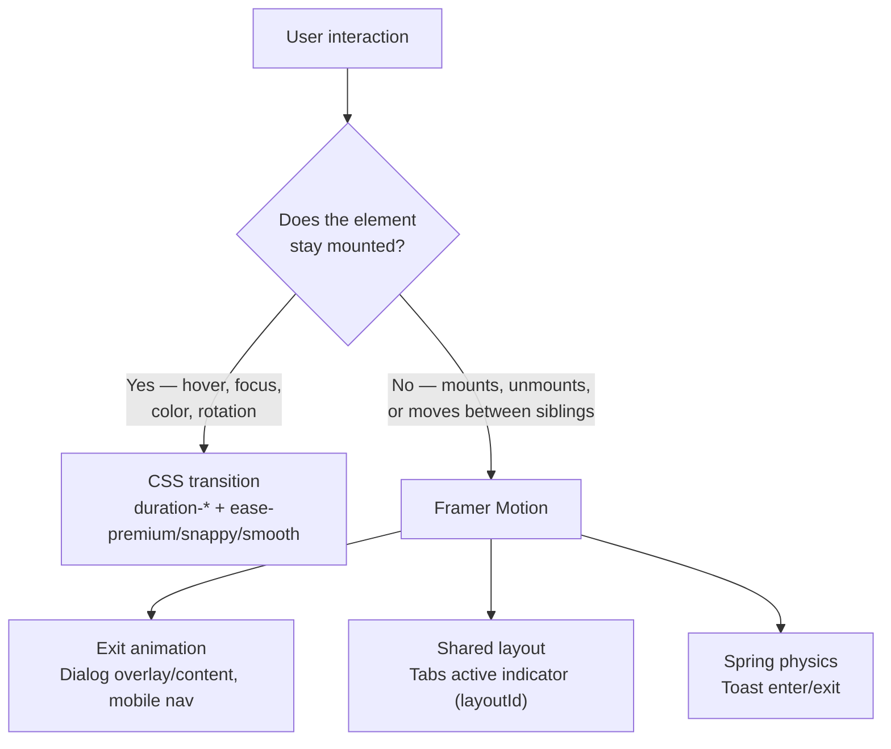
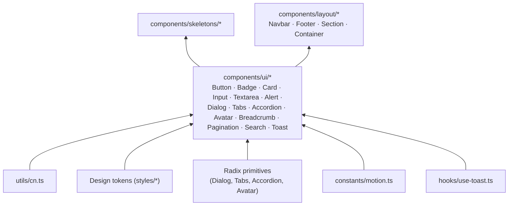

# The PetZu World — Design System

Second milestone. Builds on the foundation documented in
[ARCHITECTURE.md](ARCHITECTURE.md). **No pages were built here either** —
this is a component library: tokens (color, shadow, motion, glass, gradient)
plus 13 production-grade UI primitives, all variant-driven. Verified by a
temporary preview route that exercised every component and variant, then
deleted per this milestone's "design system only" rule.

---

## 1. Why these colors?

The palette is OKLCH, not hex/RGB, for one concrete reason: **perceptual
uniformity**. In sRGB/hex, two colors with the same lightness value can look
wildly different in actual brightness (blue reads darker than yellow at the
"same" lightness). OKLCH's lightness channel matches human perception, so:

- Generating a consistent light/dark pair for any brand hue is predictable —
  bump `L` down, hue and chroma stay put, and the result still looks like
  "the same color, darker," not a muddy shift.
- Accessible contrast ratios are easier to hit and verify by construction,
  because lightness in OKLCH tracks WCAG's perceptual contrast intent much
  more closely than sRGB lightness does.
- `color-mix(in oklch, …)` (used throughout [styles/effects.css](styles/effects.css)
  for glass/gradient utilities) blends colors the way a designer expects,
  without the muddy-gray midpoints `color-mix` produces in sRGB.

The brand hue (`45°`, warm amber) was chosen because it's a friendly,
approachable, non-corporate warmth appropriate for a pet brand — distinct
from the blue/violet SaaS-default so many products default to — while still
reading as premium at low chroma in neutral surfaces. Status colors
(success/warning/info/destructive) sit at hues chosen for universal
association (green/amber/blue/red) rather than being derived from the brand
hue, because status meaning must never be ambiguous.

## 2. Why this typography?

Three families, each with a distinct job — mixing them for decoration
would be noise, but zero variety would be sterile:

- **Geist Sans** (body/UI) — a neutral, highly legible grotesque built for
  interfaces; it disappears into the content instead of calling attention to
  itself, which is what body text and UI chrome should do.
- **Geist Mono** — for anything tabular or code-like (not heavily used yet,
  reserved for future data-dense UI).
- **Fredoka** (`--font-display`) — a rounded, friendly display face used
  sparingly for headings/logo, carrying the brand's warmth into typography
  the way the amber hue carries it into color.

The scale itself ([styles/typography.css](styles/typography.css)) is
**responsive by construction, not by breakpoint override**: each semantic
size (`text-display-2xl` → `text-caption`) ships a matched line-height and
(where relevant) letter-spacing as a single token, so a heading never
accidentally gets body-text line-height. Nothing in the component layer
hand-picks a raw `text-4xl` — every heading/label references a semantic
name, so a global type-scale adjustment is a one-file change.

## 3. Why this spacing system?

Two layers, deliberately kept separate:

- **Numeric scale** (Tailwind's default `p-4`, `gap-2`, …) for
  component-internal spacing — the small, high-frequency adjustments that
  don't carry semantic meaning.
- **Semantic scale** ([styles/spacing.css](styles/spacing.css):
  `p-card`, `py-section`, `gap-stack-md`, …) for spacing decisions that
  *do* carry meaning — "this is a section," "this is a card's padding."

The semantic layer is what keeps the app's rhythm consistent as it grows:
every `Section` uses `py-section` (not a hand-picked `py-24` that drifts
from the next section's `py-28`), every `Card` uses `p-card`. Changing "how
much air a section gets" site-wide is again a one-file change, not a
find-and-replace across every page.

## 4. Why these button variants?

Eight variants, each mapped to a distinct intent rather than a distinct
look:

| Variant | Intent |
|---|---|
| `primary` | The one action per screen that matters most |
| `secondary` | A supporting action, still visually present |
| `outline` | Present but low-commitment (e.g. "Cancel") |
| `ghost` | Minimal-chrome actions inside dense UI (toolbars, table rows) |
| `link` | Inline, text-level actions |
| `destructive` | Irreversible/dangerous actions — visually distinct so it's never mistaken for `primary` |
| `gradient` | Marketing/hero-context emphasis — the one place a gradient earns its keep |
| `glass` | Actions floating over imagery/video where a solid background would clash |

This mirrors Stripe's and Linear's own button taxonomies almost exactly —
intent-based variants, not "blue button" / "big button." Sizes (`sm/md/lg/icon`)
are separate from variant for the same reason CVA exists: variant and size
are orthogonal axes, and conflating them (`primary-large`, `primary-small`
as separate variants) multiplies the API surface for no benefit.

## 5. Why these shadows?

Every shadow in [styles/theme.css](styles/theme.css) is **multi-layer**: a
tight, low-opacity "contact" shadow plus a softer, larger-blur "ambient"
shadow, e.g.:

```css
--shadow-md: 0 4px 10px -2px rgb(0 0 0 / 0.07), 0 2px 4px -2px rgb(0 0 0 / 0.04);
```

A single hard-edged `box-shadow: 0 4px 6px black` is what reads as "default
browser/Bootstrap shadow." Two layered, low-opacity shadows is what reads as
"designed" — it's the same technique Stripe, Linear, and macOS itself use
for elevation. Dark mode gets **higher-opacity** versions of the same
shadows (not the same values reused) because a shadow that's barely visible
in light mode disappears entirely against a dark surface — elevation has to
be re-tuned per theme, not just carried over.

`--shadow-glow` is the one non-neutral shadow: a colored, brand-tinted glow
used only on the `gradient` button variant and the mesh-gradient decorative
blocks, for the rare moments an element should feel "lit up" rather than
merely "raised."

## 6. Why these border-radius values?

A single source value (`--radius: 0.75rem`) with four derived steps
(`sm/md/lg/xl` at `-4px/-2px/+0px/+4px`) plus `2xl` at `+10px`. Deriving
every radius from one base means the entire app's "roundedness" — the
single biggest visual signal of "friendly SaaS" vs. "enterprise dashboard"
vs. "sharp/brutalist" — is one number. Nothing hardcodes `rounded-lg`
expecting a specific pixel value; it's asking for "the large step in
whatever the current radius scale is." At `0.75rem` base, the app lands
solidly in the same soft-rounded territory as Linear and Stripe's
dashboard — rounder than enterprise-default (~`4px`), not as extreme as
consumer-playful (`9999px` everywhere).

## 7. Why these reusable components?

The 13 components map directly to the list requested, but each was built
to the same rule as the foundation milestone: **own the primitive that
needs accessibility behavior, compose the rest from what already exists.**

- **Radix primitives** power anything with real interaction-state
  complexity that's easy to get accessibility wrong on: `Dialog` (focus
  trap, ESC, scroll lock), `Tabs` (roving tabindex, arrow-key nav),
  `Accordion` (ARIA expanded state), `Avatar` (image-load-failure
  fallback). Reimplementing these from scratch means reimplementing a11y
  bugs Radix already fixed.
- **CVA-driven, dependency-free components** for everything that's "just"
  styled variants of a native element: `Button`, `Badge`, `Card`, `Alert`,
  `Input`, `Textarea`, `Skeleton`. No primitive library does these better
  than a plain, correctly-labeled native element.
- **Fully custom composables** for things with no accessible-primitive
  precedent to lean on: `Breadcrumb` (semantic `<nav><ol>`), `Pagination`
  (built on `Button` + a pure `getPaginationRange` util that's unit-testable
  independent of any component), `Search` (built on `Input`).
- **A hand-rolled Toast store** ([hooks/use-toast.ts](hooks/use-toast.ts))
  instead of Radix's Toast primitive — a deliberate call: Radix Toast's
  `forceMount`-based exit-animation wiring adds real complexity for a
  multi-item, auto-dismissing queue, and a module-level
  `useSyncExternalStore` store is simpler, has no provider-nesting
  requirement (`toast()` is callable from anywhere — an event handler, a
  service, a catch block), and is exactly as accessible (`role="status"`,
  `aria-live` region) with far less code to maintain.

## 8. Why this theme/motion architecture?

Same layering discipline as the color system, extended to motion:

- **CSS tokens** (`--ease-premium`, `--ease-snappy`, …, plus the elevation
  scale) drive every *continuous, stateless* transition — hovers, focus
  rings, color changes, the accordion chevron's rotation. These are cheap,
  GPU-composited, and don't need JavaScript.
- **Framer Motion** ([constants/motion.ts](constants/motion.ts) for the
  JS-side duration/easing tokens, mirroring the CSS ones so the two motion
  systems feel identical) is reserved for what CSS genuinely cannot do
  cleanly: **exit animations** (Dialog's overlay/content, the mobile nav
  menu — anything that needs to animate *before* leaving the DOM, which a
  plain `display: none` can't), **shared-layout animation** (the Tabs
  active-indicator sliding between triggers via `layoutId`), and **spring
  physics** (Toast's entrance, which reads more alive as a spring than an
  eased tween).

This is a deliberate split, not an oversight: reaching for Framer Motion on
every hover state would mean shipping JavaScript for something the browser
already does for free, and would make simple interactions feel *heavier*,
not more premium. The rule in this codebase is: **CSS transitions for
anything that stays mounted; Framer Motion for anything that mounts,
unmounts, or shares layout.**

`Glassmorphism` and gradients follow the same "own the primitive, expose it
as a token" pattern as color: `glass` / `glass-strong` / `bg-gradient-brand`
/ `bg-gradient-mesh` / `text-gradient-brand` are Tailwind v4 `@utility`
classes in [styles/effects.css](styles/effects.css) built with
`color-mix(in oklch, var(--color-…) …)`, so they automatically track
whatever the current theme's background/primary/info/success colors are —
a glass card doesn't need a `.dark` override; it's already theme-aware by
construction.

## 9. Compared to Apple, Stripe, and Linear

| | Apple (HIG) | Stripe | Linear | This system |
|---|---|---|---|---|
| **Color model** | Dynamic/semantic colors, P3 wide-gamut | Semantic tokens, high-contrast neutrals | Semantic tokens, near-monochrome + one accent | OKLCH semantic tokens, one warm accent |
| **Depth** | Materials (blur/vibrancy), soft shadows | Soft, layered shadows; minimal glass | Near-flat, relies on borders + subtle shadow | Layered shadows **+** glass utilities (closer to Apple here) |
| **Motion** | Physically-modeled, spring-heavy | Restrained, functional easing | Snappy, precise, low-latency feel | Spring for transient UI (toast), expo-out for deliberate UI (dialog) — a deliberate blend of Apple's physicality and Stripe's restraint |
| **Radius** | Continuous "squircle" curvature | Moderate (~6–8px) | Moderate-to-tight (~6–10px) | `0.75rem` base — Stripe/Linear territory, not squircle |
| **Typography** | San Francisco, very restrained scale | Custom grotesque, tight scale | Inter-like, dense | Geist (Stripe/Linear-adjacent) + a friendly display face for brand warmth |

The honest positioning: this system borrows Stripe's **token discipline**
(everything semantic, nothing hardcoded), Linear's **motion precision**
(fast, purposeful, never decorative-for-its-own-sake), and Apple's
**material language** (glass, layered depth) — applied to a **warmer, more
approachable brand identity** than any of the three, because PetZu is a
consumer pet brand, not enterprise infrastructure or a dev tool. The
engineering discipline is borrowed from B2B SaaS; the visual warmth is not.

## 10. Notes and diagrams

### Token flow



### Motion split



### Component dependency layers



### Component → variant reference

| Component | Variants |
|---|---|
| `Button` | primary · secondary · outline · ghost · link · destructive · gradient · glass  ×  sm · md · lg · icon |
| `Badge` | primary · secondary · outline · success · warning · info · destructive |
| `Card` | default · elevated · ghost · outline · glass  ×  interactive (hover-lift) |
| `Alert` | default · info · success · warning · destructive |
| `Input` / `Textarea` | default · error  ×  sm · md · lg |
| `Toast` | default · info · success · warning · destructive |
| `Avatar` | sm · md · lg · xl |
| `Dialog` | controlled `open`/`onOpenChange`, optional `trigger` |
| `Tabs` | controlled or uncontrolled, animated active indicator |
| `Accordion` | single/multiple, collapsible |
| `Pagination` | numeric range + ellipsis, configurable `siblingCount` |
| `Search` | sm · md · lg, optional clear button / shortcut hint |
| `Breadcrumb` | composable (List/Item/Link/Page/Separator/Ellipsis) |

---

**A bug found and fixed during this milestone's verification pass:** the
first `Dialog` implementation accepted `DialogTrigger` as a `children`
element, but `children` only renders while `open` is `true` — meaning the
trigger that's supposed to *set* `open` to `true` could never mount in the
first place. Fixed by making `trigger` its own prop, rendered unconditionally
via `DialogPrimitive.Trigger`, separate from the animated `children` content.
This is exactly the kind of bug a real interaction smoke-test catches that a
type-check or lint pass cannot.
