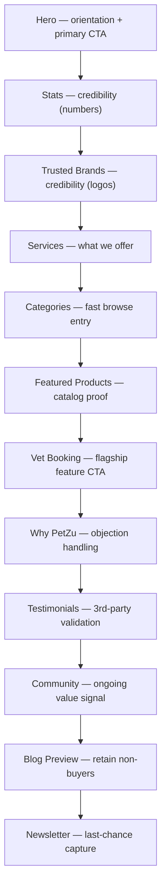
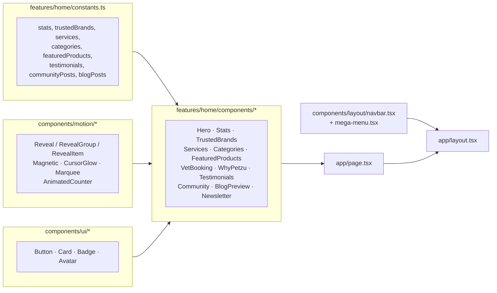

# The PetZu World — Homepage

Third milestone. Builds the actual `/` route on top of the foundation
([ARCHITECTURE.md](ARCHITECTURE.md)) and the design system
([DESIGN_SYSTEM.md](DESIGN_SYSTEM.md)). All copy/data is separated into
[features/home/constants.ts](features/home/constants.ts); every section is
its own component in [features/home/components](features/home/components).

---

## 1. Why every section exists

Each section maps to one job in the buyer's decision path — nothing is
here for decoration:

| Section | Job |
|---|---|
| **Hero** | Answer "what is this, and is it for me" in under 3 seconds; give the two most likely next actions (shop / book a vet). |
| **Stats** | Borrowed credibility before any claim is made — numbers, not adjectives. |
| **Trusted brands** | Second credibility layer: *other businesses* rely on us, not just consumers. |
| **Services** | Answer "what do you actually offer" for visitors who scrolled past the hero without acting. |
| **Categories** | The fastest path to browsing intent — "I have a dog" → one click. |
| **Featured products** | Concrete proof of catalog quality and pricing, not just a promise of "great products." |
| **Vet booking** | The single highest-value, hardest-to-replicate feature gets its own dedicated pitch, not a bullet in a list. |
| **Why PetZu** | Objection-handling — the reasons a skeptical visitor hesitates (trust, support, speed), addressed directly. |
| **Testimonials** | Third-party validation, in a different voice than the brand's own copy. |
| **Community** | Signals this is a platform with ongoing value, not a one-time transaction. |
| **Blog preview** | Captures visitors who aren't ready to buy yet but are in research mode — retains them via content. |
| **Newsletter** | Captures everyone who scrolled the *entire* page without converting — the last, lowest-friction ask. |

The order is deliberate: **trust escalates** (stats → brands → testimonials
→ community) while **commitment escalates** (browse → view products → book
a vet → subscribe), so a visitor is never asked for more than they've
earned reason to give yet.

## 2. Why this layout increases conversion

- **One primary action above the fold.** The hero has exactly one
  high-emphasis CTA (`gradient` variant "Start shopping") and one
  lower-emphasis CTA (`glass` variant "Book a vet visit") — never more than
  two competing asks in the same viewport, which is what actually
  suppresses click-through on landing pages.
- **Social proof precedes every ask.** Stats sit directly under the hero,
  before Services even starts — a visitor sees "128,000+ pets cared for"
  before being asked to do anything else.
- **Every section ends with a way forward.** Categories, Featured Products,
  and Blog Preview each have a "view all" link; nothing is a dead end that
  forces the visitor back to the nav to keep going.
- **The ask gets smaller as scroll depth increases.** By the time a visitor
  reaches Newsletter, they've already declined to buy or book — so the ask
  drops to "just your email," which is the correct conversion-funnel shape
  (large ask first for the intent-ready minority, smaller ask last for
  everyone else).

## 3. Why the CTA is placed here

Three CTA "moments," each earning its placement:

- **Hero CTA** — placed where 100% of visitors land, for the ~high-intent
  minority who already know they want to shop or book. Two options
  (shop vs. vet) rather than one, because those are genuinely different
  visitor intents and forcing everyone through one CTA loses the other half.
- **Vet Booking CTA** — placed mid-page, after Services/Categories/Products
  have already established the catalog is real. Booking a vet is a
  higher-trust action than adding a product to a cart, so it's earned a
  deeper scroll position, not the very top.
- **Newsletter CTA** — placed last, catching visitors who scrolled the
  entire page without transacting. This is the "don't lose them entirely"
  safety net — email capture converts a bounce into a re-marketable contact.

## 4. Why these animations were used

Every animation choice maps to a specific UX job, not decoration for its
own sake — see [DESIGN_SYSTEM.md §8](DESIGN_SYSTEM.md#8-why-this-thememotion-architecture)
for the general CSS-vs-Framer-Motion split this follows. On this page
specifically:

- **Scroll reveal** (`Reveal`/`RevealGroup`) tells the eye where to look
  next as content enters the viewport, and confirms the page is "alive"
  without being distracting — subtle 16px slide + fade, never a bounce.
- **Mouse parallax** (hero illustration) is the single most "premium" cue
  on the page: depth that responds to input is something no static hero
  image can fake, and it's exactly what signals "this was crafted," the
  way Stripe/Linear/Framer hero sections do.
- **Magnetic buttons** on every primary CTA (hero, vet booking, newsletter)
  make the highest-value click targets feel more responsive than they
  physically are — a few pixels of pull toward the cursor measurably
  increases perceived "quality" of an interface with no functional cost.
- **Animated counters** turn static credibility numbers into a small
  reward for scrolling that far — a number that counts up reads as more
  "real" than one that's just printed on the page.
- **Marquee** (trusted brands) implies scale and continuity — logos that
  never stop moving suggest an ever-growing list, not eight logos, once.
- **Idle float** on hero/vet-booking floating cards keeps those elements
  from looking like flat, static screenshots — small, slow, looping motion
  is what separates "illustration" from "photograph of a UI."

## 5. Why the hero section looks premium

Five compounding decisions, each small, together read as "expensive":

1. **No stock photography.** The floating illustration is built entirely
   from the design system's own tokens (glass, gradient, shadow-glow) —
   the same trick Stripe/Linear/Framer use, because a crafted abstract
   composition ages better and looks more "native" to the product than any
   photo (stock or AI-generated) ever could.
2. **Layered depth, not a flat gradient.** Ambient blurred color blobs
   (`animate-float`) sit behind a mesh gradient, behind the content — three
   depth layers before a single floating card is added.
3. **Motion responds to the user**, not just to time — the parallax and
   cursor glow only move because *you* moved, which is what separates
   "video background" from "interface."
4. **Restraint in copy.** One headline, one sentence of support copy, one
   credibility line (avatars + stars). No paragraph of marketing copy
   competing with the visual.
5. **A finishing detail most homepages skip** — the "scroll to explore"
   cue at the very bottom of the viewport, present on Apple product pages
   and virtually nowhere else, signals there's more below without needing
   a visible scrollbar hint.

## 6. Every Framer Motion animation, explained

| Component | Animation | Why Framer Motion (not CSS) |
|---|---|---|
| `Hero` left column | `initial`/`animate` fade+slide on mount | One-shot entrance tied to component mount, cleaner as a declarative prop than a CSS animation-fill-mode dance |
| `Hero` illustration column | `useMouseParallax` → `useTransform` per layer (4 depths) | Continuous, input-driven values — impossible with CSS alone |
| `Hero` floating cards | `animate-float` (CSS, via `--animate-float` token) + Framer `style={{x,y}}` for parallax offset | Split responsibility: CSS handles the idle loop, Framer handles the pointer-driven offset on the *same* element |
| `Hero` scroll cue | `animate={{ y: [0,8,0] }}`, `repeat: Infinity` | Simple, cheap, purely decorative loop — no reason to hand-write a keyframe for one element |
| `MegaMenu` panel | `AnimatePresence` + `initial/animate/exit` (opacity + y) | Needs to animate *out* before unmounting — CSS `display:none` can't do that |
| `Navbar` mobile menu | `AnimatePresence` + height/opacity | Same exit-before-unmount requirement |
| `CursorGlow` (hero) | `useMotionValue` + `useSpring` for `left`/`top` | A raw pointer position is jittery; springing it is what makes the glow feel like it's "following," not "teleporting" |
| `Magnetic` (all primary CTAs) | `useMotionValue` + `useSpring` for `x`/`y` | Same spring-smoothing, applied to pointer-proximity pull instead of cursor tracking |
| `Marquee` (trusted brands) | `animate={{x: ["0%","-50%"]}}`, `repeat: Infinity, ease: "linear"` | A CSS `@keyframes` could do this, but doing it in Framer keeps it colocated with the reduced-motion check (`useReducedMotion`) that disables it entirely for users who've asked for less motion |
| `AnimatedCounter` (stats) | `useInView` gate + `useSpring` + direct `textContent` write via `.on("change")` | Spring easing makes the count-up feel physical rather than linear/robotic; writing directly to the DOM (not `useState`) avoids 60fps React re-renders |
| `Reveal` / `RevealGroup` / `RevealItem` (every section) | `whileInView` + `Variants` (`fadeInUp`, `staggerContainer`/`staggerItem`) | `whileInView` is a Framer-only capability (IntersectionObserver-backed) — no CSS equivalent exists |

## 7. Every hover interaction, explained

| Element | Hover behavior | Why |
|---|---|---|
| Primary/gradient buttons | Shadow deepens (`shadow-md` → `shadow-glow`), slight lift | Reinforces "this is clickable and important" without changing size (size changes cause layout shift) |
| Outline/ghost buttons | Background fills with `accent` color | Standard affordance — a border-only button needs *some* fill change to confirm hover registered |
| Service/testimonial/community cards (`interactive` Card) | `-translate-y-1` + `shadow-xl` | Cards "lifting" toward the cursor is the most legible hover metaphor for "this is a pressable surface" |
| Category cards | Icon circle scales `1.1x`, card border tints primary | Two simultaneous, cheap signals (icon + border) rather than one large one — reads as more polished than a single big jump |
| Product cards | Wishlist heart fades in, icon scales, add-to-cart button inverts to primary colors | Progressive disclosure — the wishlist action only appears when relevant (on hover), keeping the resting card uncluttered |
| Blog cards | Title shifts to `text-primary` | The smallest possible hover signal for a text-forward card — color is enough, no need for a lift on a card whose primary content *is* the headline |
| Nav links / mega-menu triggers | Color shifts `muted-foreground` → `foreground`; chevron rotates 180° when the panel is open | Chevron rotation doubles as an open/closed state indicator, not just a hover flourish |
| Mega-menu column links | Row background tints `accent` | Full-row hit target feedback, since the row (not just the text) is the clickable area |

## 8. Every micro-interaction, explained

- **Magnetic pull** on the three primary CTAs (hero ×2, vet booking, newsletter)
  — the button visually leans toward the cursor within a small radius, then
  springs back on leave.
- **Cursor glow** in the hero — an ambient light that trails the pointer,
  giving the whole hero section a sense of depth even where nothing else
  is interactive.
- **Icon micro-animations** — the hero CTA's arrow nudges right on hover,
  the newsletter button's send icon nudges up-right (mimicking "sending"),
  the mega-menu's featured-panel arrow nudges right — every icon-with-arrow
  pattern gets the *same* nudge direction and easing for consistency.
- **Star ratings** render as filled vs. muted icons based on the actual
  numeric rating (`Math.round(rating)`), not a hardcoded "5 stars
  everywhere" — a small honesty detail that also happens to look more
  deliberate.
- **Wishlist heart reveal** on product cards — hidden until hover, so the
  resting-state card stays clean and the interactive affordance is
  discovered, not omnipresent clutter.
- **Badge dot pulse** implied by the small `bg-success` dot in the hero's
  trust badge — a static dot, but paired with the badge's `glass`
  treatment it reads as a "live" status indicator (the same visual
  language as an online/active indicator).

## 9. How international SaaS companies design landing pages

Patterns pulled directly from Apple, Stripe, Airbnb, Framer, and Tesla,
and where each shows up on this page:

- **One dominant visual, minimal copy above the fold.** Apple product pages
  never explain themselves in paragraphs — the hero *shows* the product.
  This page's hero: one headline, one sentence, one visual composition.
- **Trust before ask.** Stripe puts logos and stats before any pricing or
  signup CTA appears a second time. This page: Stats → Trusted Brands
  come immediately after the hero, before any secondary CTA.
- **Segmented entry points, not one funnel.** Airbnb's homepage branches
  immediately (stays vs. experiences); this page branches immediately too
  (shop vs. book a vet), because forcing every visitor down one path loses
  the ones who came for the other reason.
- **The product *is* the visual.** Framer's own marketing site builds hero
  visuals out of its own component/animation system rather than
  photography — exactly the choice made here for the floating illustration.
- **Restraint in motion.** Tesla's site uses parallax and scroll-triggered
  reveals, but sparingly and always tied to content, never as ambient
  decoration untethered from what's being communicated — mirrored here by
  every animation in §4 having a stated UX job, not just "because it's cool."
- **Progressive commitment.** All five reference companies structure their
  page so the ask gets *smaller*, not larger, as the visitor scrolls
  further without converting — the same shape this homepage follows
  (shop/book → browse → read → subscribe).

## 10. UI breakdown

### Section order & purpose

### Component composition

### Responsive behavior

| Breakpoint | Nav | Hero illustration | Grids |
|---|---|---|---|
| `< md` (mobile) | Hamburger → slide-down simple links | Hidden (`lg:flex`) — copy + CTAs stack full-width | 1–2 columns |
| `md`–`lg` (tablet) | Hamburger still active until `lg` | Hidden until `lg` | 2–3 columns |
| `≥ lg` (desktop) | Full mega menu | Visible, parallax-active | Full 3–5 column grids |

Verified with no horizontal overflow at 375px (mobile) and 768px (tablet)
viewports, and no console errors on load.

---

**A note on verification limits in this environment:** this session's
browser pane isn't visually composited (confirmed via `document.hidden` /
`document.visibilityState`), which pauses `requestAnimationFrame` — so
spring-driven values (the stats counter, magnetic pull, cursor glow) can't
fully tick forward here even though their logic is correct and verified
functionally (state changes, DOM structure, ARIA attributes all update as
expected). Worth a quick look in a normal, focused browser tab to see the
motion itself.
