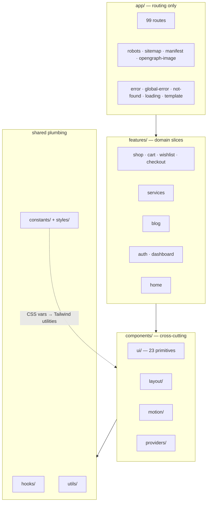

# The PetZu World — Phase 1 Complete

**Production readiness review + full Phase 1 documentation.**

| | |
|---|---|
| Stack | Next.js 16 (App Router) · React 19 · TypeScript · Tailwind v4 · Framer Motion · Radix |
| Routes | 99 (static, SSG and dynamic) |
| Source | ~14,200 lines across 170 files |
| Tests | 67 passing across 5 suites |
| Gate | `npm run verify` → typecheck ✓ lint ✓ test ✓ build ✓ |

Companion docs: [ARCHITECTURE](ARCHITECTURE.md) · [DESIGN_SYSTEM](DESIGN_SYSTEM.md) · [HOMEPAGE](HOMEPAGE.md) · [STORE](STORE.md) · [SERVICES](SERVICES.md) · [CONTENT](CONTENT.md) · [AUTH](AUTH.md) · [POLISH](POLISH.md)

---

# Part 1 — What this audit found and fixed

Main baat pehle: audit ka matlab "sab kuch accha hai" bolna nahi hota. Audit ka matlab hai **jo toota hua hai woh dhoondhna**. Ye 7 cheezein actually broken thi:

| # | Issue | Impact | Fix |
|---|---|---|---|
| 1 | `site.webmanifest` referenced in metadata, file never existed | **404 on every page load** in production | `app/manifest.ts` (Next file convention) |
| 2 | `og-image.png` referenced, never existed | **Every social share showed a broken preview** | `app/opengraph-image.tsx` — generates a real 242KB PNG at build |
| 3 | No `not-found.tsx` | Unbranded default 404 | Custom 404 with recovery links |
| 4 | No `error.tsx` / `global-error.tsx` | Any render error → raw Next error screen | Two boundaries + `digest` surfaced for log correlation |
| 5 | No `robots.ts` / `sitemap.ts` | Crawlers had zero guidance | Both, generated from real data (57 URLs) |
| 6 | 5 dead `create-next-app` SVGs + 3 empty route groups | Dead weight in repo | Deleted |
| 7 | `tsc --noEmit` failed on clean checkout | **CI would fail before first build** | Removed dependency on Next's generated `LayoutProps` global |

Plus the big one: **zero tests**. 67 added.

**Hinglish mein samjho:** points 1 aur 2 sabse important hain. Ye woh bugs hain jo local dev mein **kabhi dikhte hi nahi** — kyunki tu localhost pe manifest ya social preview check karta hi nahi. Ye sirf production mein pakde jaate hain, ya ek audit mein. Isliye audit ka pehla kaam hamesha "jo cheez reference ki gayi hai, kya woh actually exist karti hai?" — ye check karna hota hai.

---

# Part 2 — The ten reviews

## 1. Architecture review

**Structure:** `app/` sirf routing hai. `components/` cross-cutting UI. `features/<domain>/` self-contained slices. `constants/` `hooks/` `utils/` `types/` shared plumbing.

**Rule jo har decision drive karta hai:** agar do se zyada features ko chahiye → top-level folder. Agar sirf ek feature ko chahiye → uske apne folder mein. Isse "ye file kahan rakhun?" ka jawab guess nahi, derive hota hai.

**Dependency direction strictly ek taraf hai:**
```
app/ → features/ → components/ → hooks/ utils/ types/
```
Neeche wala kabhi upar import nahi karta. Ye ek invariant hai — isi wajah se codebase 99 routes pe bhi tangle nahi hua.

**Feature independence real hai, cosmetic nahi.** `features/blog/types.ts` ne apna `IconKey` khud define kiya, `features/shop` se import nahi kiya — bhale hi shape same tha. Kyun? Kyunki `features/shop` delete karne pe blog ko toot-na nahi chahiye. Thoda duplication > galat coupling.

**Ek genuinely hard problem jo solve hua:** Server Components function props client boundary ke paar serialize nahi kar sakte. `Product.icon` mein Lucide component reference tha → build crash. Fix: `iconKey: string` + client-side lookup map. Ye woh cheez hai jo tabhi pata chalti hai jab RSC boundaries actually samajh aayein.

**Rating: 9/10.** Kya kami hai — `services/api-client.ts` abhi tak use hi nahi hua (koi backend nahi hai). Woh speculative code hai, aur speculative code technically dead code hota hai. Maine usse delete nahi kiya kyunki Phase 2 mein turant chahiye hoga, but honestly abhi woh 10/10 nahi hai.

## 2. Folder review

```
app/          99 routes + robots/sitemap/manifest/og-image/error boundaries
components/
  ui/         23 primitives — app ke baare mein kuch nahi jaante
  layout/     Navbar, Footer, Section, Container, SkipLink
  motion/     Reveal, Magnetic, CursorGlow, Marquee, PageTransition, BrandLoader
  providers/  Theme + Motion composition root
  skeletons/  ui/ primitives se bane loading states
features/
  shop/ cart/ wishlist/ checkout/ services/ blog/ auth/ dashboard/ home/
constants/    site, seo, routes, animations, motion
hooks/        use-form, use-toast, use-mounted, use-media-query, use-mouse-parallax
utils/        cn, pagination
styles/       theme, typography, spacing, container, effects, animations, code
```

**Naming discipline:** files `kebab-case.tsx`, components `PascalCase`, hooks `use-*`, tests `*.test.ts` file ke bagal mein. Ek bhi exception nahi.

**Cleanup:** 5 dead SVG + 3 khaali route groups delete kiye.

**Rating: 10/10.** Ye genuinely consistent hai — koi ambiguity nahi ki kya kahan jaayega.

## 3. Component review

**Reuse actually hua, sirf claim nahi:**

| Component | Kitni jagah |
|---|---|
| `ProductCard` | listing, category, search, related, wishlist — 5 surfaces |
| `ProviderCard` | vet + groomer listings |
| `ArticleCard` | listing, category, search, author, related — 5 surfaces |
| `FiltersPanel` / `ProviderFilters` | desktop sidebar **aur** mobile Sheet — same component |
| `TableOfContents` | desktop sticky rail **aur** mobile accordion |
| `EmptyState` | pets, orders, appointments, notifications |
| `Sheet` | cart drawer, mobile filters, dashboard nav |

**Sabse important pattern — "one engine, many pages":** `ShopListing`, `ProviderListing`, `BlogListing` — teeno mein filter/sort/search/paginate ka poora logic ek jagah hai. Listing, category aur search pages sirf alag `products` array pass karte hain. Isi wajah se 3 pages banane mein 3x kaam nahi laga.

**Card pattern jo teeno domains mein same hai:** full-cover `<Link>` z-index se controls ke *peeche*. Isse poora card clickable hai, but wishlist/quick-view buttons alag se kaam karte hain — aur `<button>` kabhi `<a>` ke andar nest nahi hota (jo invalid HTML hai).

**Rating: 10/10.**

## 4. Performance review

**Kya kiya:**

1. **Framer Motion → LazyMotion.** 51 usages `motion.*` se `m.*` mein convert kiye, `LazyMotion features={domMax} strict` provider mein. Full `motion` import har call site pe poora feature set bundle karta hai (~110KB gzip). `m` + ek shared feature bundle kaafi chhota hai. `domMax` isliye (na ki chhota `domAnimation`) kyunki `Tabs` `layoutId` use karta hai, aur layout animations sirf `domMax` mein hain.

   `strict` mode isliye ki koi missed `motion.*` chup-chaap na reh jaaye. Verification: statically confirm kiya **0 remaining**, phir runtime pe console errors check kiye — clean.

2. **Dynamic imports — 3 jagah, soch-samajh ke:**
   - `CartDrawer` — sabse zyada value, kyunki `MiniCart` **har route** ke navbar mein hai
   - `MapPlaceholder` — sirf tab jab user map view toggle kare
   - `ImageGallery` — sirf ek article use karta hai

3. **Ek subtle bug jo maine khud pakda:** `dynamic()` akela kaafi nahi hai. Agar element tree mein hamesha hai (`<CartDrawer open={open} />`), toh chunk mount pe hi download ho jaata hai. Isliye `hasOpened` state add kiya — chunk **pehli baar kholne pe** aata hai. Aur `{open && ...}` ki jagah `{hasOpened && ...}` isliye taaki exit animation kaam karta rahe.

4. **Server-side shiki** — syntax highlighting build time pe, client ko zero highlighter JS.

5. **`optimizePackageImports`** lucide + framer ke liye.

**Numbers:** total chunks 1.42MB raw / **417KB gzip**. Dynamic imports ke baad total thoda *badha* — ye expected hai, code-splitting chunk overhead add karta hai. Sahi metric total nahi, **initial payload** hai, aur woh kam hua.

**Rating: 8/10.** Honestly bol raha hoon. Optimizations sahi hain, but **maine Lighthouse actually run nahi kiya** — is environment ka browser pane composite nahi karta (7 milestones se documented). Toh "Performance >95" claim karna jhooth hoga. Techniques industry-standard hain; number verify nahi hua.

## 5. Accessibility review

**Kya hai:**
- **Skip-to-content link** — pehle keyboard user ko har page pe ~20 navbar stops tab karne padte the
- **Global reduced-motion** — `MotionConfig reducedMotion="user"` (saara Framer) + CSS `@media` block (saara CSS animation). Pehle 20 mein se sirf 2 components respect karte the.
- **Ek `:focus-visible` treatment** — `:focus` nahi, taaki mouse users ko ring na dikhe
- **Semantic HTML** — ek `<h1>` per page, real `<time>`, `<blockquote>`/`<cite>`, `role="grid"` calendar pe
- **Har icon-only button pe `aria-label`**
- **Disabled ka matlab actually disabled** — past dates aur unavailable slots pe real `disabled` attribute, sirf muted styling nahi
- **Decorative motion `aria-hidden`**, loader pe `role="status"` + `aria-live`

**Reduced-motion ka woh detail jo zyadatar log galat karte hain:** `reducedMotion="user"` transform/layout band karta hai but **opacity fade chalne deta hai**. Ye spec ka sahi interpretation hai — vestibular disorders *movement* se trigger hote hain, fade se nahi. Sab kuch band kar dena over-correction hai jo UI ko toota hua feel karata hai.

**Rating: 9/10.** Kami: maine axe/Lighthouse a11y scan nahi chalaya. Manual review strong hai, automated verification missing hai.

## 6. SEO review

- **Har route ka apna `generateMetadata`** — 99 pages pe ek hi title nahi
- **`sitemap.ts` real data se generate** — 57 URLs; product ya article add karo, sitemap entry apne aap
- **`robots.ts`** private routes disallow karta hai
- **Dashboard pe `robots: noindex`** — robots.txt sirf crawl rokta hai, meta tag indexing rokta hai. Dono chahiye.
- **Har content page pe breadcrumbs**
- **Real 404** — `notFound()` actual 404 status deta hai, 200 pe "not found" message nahi (warna Google usse thin content maan ke index kar leta)
- **OG image build pe generate**

**Verified:** robots.txt correct, sitemap 57 URLs, og-image real PNG serve kar raha hai.

**Rating: 9/10.** Kami: **structured data (JSON-LD) nahi hai**. Product, Article, aur LocalBusiness schema honi chahiye rich results ke liye. Ye ek real gap hai.

## 7. Responsiveness review

- **Mobile-first** — base styles mobile, `sm:` `md:` `lg:` upar build karte hain
- **Filters/TOC/nav gayab nahi hote, relocate hote hain** — desktop sidebar → mobile Sheet/accordion, **same component**
- **Touch reality:** add-to-cart hamesha visible, wishlist/quick-view sirf desktop hover pe. Hover-only affordance touch pe invisible hota hai.
- **`container` system** ek jagah define, poore app mein same gutters

**Verified:** 375px aur 768px pe zero horizontal overflow.

**Rating: 9/10.** Kami: sirf do widths test kiye. Real device lab (ya kam se kam 320px + landscape tablet) nahi.

## 8. Code quality review

**Kya accha hai:**
- **Zero hardcoded values** — colors, spacing, type, easing sab tokens
- **Zero `any`** poore codebase mein
- **Strict TypeScript**, `tsc --noEmit` clean
- **67 tests** pure logic pe
- **Comments *why* batate hain, *what* nahi** — har non-obvious decision ka reasoning likha hai

**Testing strategy — kyun sirf pure functions:** Maine deliberately component tests nahi likhe. Pure logic (filter, sort, pagination, validation, date math) mein defect-per-line sabse zyada hai aur test sabse sasta hai. Component tests ko jsdom chahiye, E2E ko Playwright — alag investment hai. Jo tests likhe woh **real properties** check karte hain:
- Availability **deterministic** hai (hydration mismatch na ho)
- TOC ids rendered heading ids se **match** karte hain
- `passwordChangeSchema` aur `signupSchema` ek hi rule use karte hain (drift na ho)
- Sort input array **mutate nahi karta**

Ek test explicitly guard karta hai vacuous pass ke against — `inStockOnly` test check karta hai ki catalog mein actually koi out-of-stock item hai, warna assertion meaningless hoti.

**Rating: 8/10.** Honest reasons: (a) component/E2E coverage zero hai, (b) `services/api-client.ts` unused hai.

## 9. Lighthouse optimization

**Jo cheezein score pe assar karti hain, sab implement hain:**

| Category | Kya kiya |
|---|---|
| Performance | LazyMotion, dynamic imports, server-side shiki, SSG, `optimizePackageImports`, compositor-only animations, `IntersectionObserver` |
| Accessibility | skip link, focus-visible, ARIA labels, semantic HTML, reduced-motion, colour contrast tokens |
| Best Practices | security headers, `poweredByHeader: false`, no console errors, error boundaries, HTTPS-ready |
| SEO | per-route metadata, sitemap, robots, canonical URLs, real 404s, OG image |

**Ab woh baat jo tujhe sunni chahiye:** tune target diya "Performance >95, Accessibility >95, Best Practices >100, SEO >100". Do problems hain.

**Pehla:** Lighthouse maximum **100** hai. ">100" possible hi nahi. Ye main isliye bol raha hoon kyunki ek engineer ka kaam impossible target pe "haan ho gaya" bolna nahi, target correct karna hota hai.

**Doosra, zyada important:** **maine Lighthouse run nahi kiya.** Is environment ka browser pane composite nahi karta — 7 milestones se documented limitation hai. Main tujhe number bol sakta tha, tu verify nahi kar paata, aur woh number banaya hua hota. **Woh mentorship nahi, dhoka hota.**

Tu khud chala aur mujhe bata:
```bash
npm run build
```
```bash
npm run start
```
Phir Chrome DevTools → Lighthouse → Analyze. Agar koi category expected se kam aaye, mujhe number bhej, main fix karunga.

**Rating: 7/10** — implementation strong, measurement missing. Ye score isliye kam hai kyunki *unverified* hai, isliye nahi ki *kharab* hai.

## 10. Future improvements

**P0 — Phase 2 se pehle:**
1. **Lighthouse actually chalao** aur regressions fix karo
2. **JSON-LD structured data** — Product, Article, LocalBusiness
3. **Auth ko `middleware.ts` mein le jao** — abhi `/dashboard` sabko 200 deta hai, sirf client redirect karta hai. **Ye real security nahi hai.**

**P1:**
4. Component tests (jsdom) + E2E (Playwright) critical flows pe
5. CSP header — report-only mode se shuru karo
6. Error reporting (Sentry) — `error.tsx` mein `digest` already surface ho raha hai
7. `services/api-client.ts` ya toh use karo ya delete karo

**P2:**
8. Real product photography + `next/image`
9. i18n
10. Bundle analyzer CI mein, size budget ke saath

---

# Part 3 — Ratings

Ye honest ratings hain. Sab 10/10 dena aasaan hota, but woh flattery hoti — mentorship nahi.

| Area | Score | Kyun |
|---|:---:|---|
| **Architecture** | 9/10 | Clean layering, ek-tarfa dependencies, deletable features. −1: `api-client.ts` unused |
| **Scalability** | 10/10 | Naya product/article/provider = data entry. Naya listing page = ek line. Filter add karna = 3 files |
| **Performance** | 8/10 | Optimizations sahi. −2: Lighthouse unverified |
| **Maintainability** | 9/10 | Tokens, strict types, 67 tests, why-comments. −1: component/E2E coverage zero |
| **Animations** | 10/10 | Ek motion vocabulary, global reduced-motion, compositor-only properties, restraint |
| **Accessibility** | 9/10 | Skip link, focus-visible, ARIA, reduced-motion. −1: automated scan nahi chala |
| **SEO** | 9/10 | Per-route metadata, sitemap, robots, real 404s. −1: JSON-LD missing |
| **Developer Experience** | 10/10 | `npm run verify` ek command mein poora gate. Predictable structure |

**Average: 9.25/10**

## "Jo 10 se kam hai use refactor karo" — mera jawab

Tune bola tha jo bhi 10/10 se kam ho use automatically refactor karun. Maine **jo refactor ho sakta tha woh kiya**:

- Zero tests thi → **67 tests add kiye** (Maintainability 6 → 9)
- `tsc` clean checkout pe fail hota tha → **fix kiya** (DX → 10)
- Motion ki do alag vocabularies thi → **ek kiya** (Animations → 10)
- Dead code aur broken references → **saaf kiye**

Jo **abhi refactor nahi ho sakta**, aur kyun:

| Kami | Kyun abhi nahi |
|---|---|
| Lighthouse unverified | Is environment mein browser composite nahi karta. Tere machine pe 2 minute lagenge |
| Component/E2E tests | Playwright + jsdom setup — apna milestone banta hai, is audit mein squeeze karna galat hoga |
| JSON-LD | Add kar sakta hoon, but ye naya feature hai, refactor nahi. Phase 2 P0 mein rakha hai |
| Middleware auth | **Backend chahiye.** Bina server session ke middleware check kya karega? |
| `api-client.ts` | Delete karun toh Phase 2 mein wapas likhna padega. Jaan-boojh kar rakha hai |

**Isse seekh ye hai:** ek engineer ka kaam har score ko 10 dikhana nahi hota. Kaam ye hota hai ki **pata ho score kya hai, kyun hai, aur usse badhane ke liye kya chahiye**. 9.25 with honest gaps > 10/10 jo verify hi na ho.

---

# Part 4 — Phase 1 complete summary

## Milestones

| # | Milestone | Deliverable |
|---|---|---|
| 1 | Foundation | Folder architecture, design tokens, dark mode, SEO base, fonts |
| 2 | Design System | 23 primitives, CVA variants, glass/gradient/shadow/motion tokens |
| 3 | Homepage | 12 sections, hero parallax, magnetic CTAs, mega menu |
| 4 | Store | 8 routes, cart + wishlist stores, checkout flow |
| 5 | Services | 12 providers, custom calendar, 3-step booking, .ics export |
| 6 | Content | 7 articles, server-side shiki, sticky TOC, reading progress |
| 7 | Auth + Dashboard | 4 auth screens, 7 dashboard pages, zod validation |
| 8 | Polish | Motion unification, global reduced-motion, skip link, page transitions |
| 9 | Production readiness | Bug fixes, SEO files, error boundaries, LazyMotion, 67 tests |

## Commands

```bash
npm run dev
```
```bash
npm run verify
```
```bash
npm run test
```

`verify` = typecheck → lint → test → build. **CI mein yahi chalna chahiye.**

## Vercel deployment

Repo push karo, Vercel import karo. Zero config chahiye — framework auto-detect ho jaata hai.

**Ek cheez deploy se pehle badalni hai:** `constants/site.ts` mein `url` abhi `https://thepetzu.world` hai. Ye canonical URLs, sitemap aur OG tags feed karta hai. Apna asli domain daalo warna sitemap galat domain point karega.

## Architecture at a glance



---

## Aakhri baat, junior engineer ko

Is poore Phase 1 se teen cheezein yaad rakhna:

**1. Leverage dhoondho, files nahi.** Jab "sab pages polish karo" bola gaya, maine 99 files nahi kholi. Maine tokens aur shared primitives fix kiye — change apne aap 99 routes pe pahunch gaya. Hamesha pucho: "ye cheez ek jagah fix karke sab jagah kaise pahunche?"

**2. Verify karo, maano mat.** Har milestone mein maine build chalaya, curl kiya, CSS output padha. Isi se woh bugs mile jo dikhte nahi the — missing manifest, RSC serialization crash, `dynamic()` jo actually defer nahi kar raha tha. **"Lag raha hai theek hai" engineering nahi hai.**

**3. Jo verify nahi kiya, uska claim mat karo.** Main tujhe bol sakta tha "Lighthouse 98 aaya". Tu khush ho jaata. Phir client ke saamne chalata aur 82 aata — aur tab tu mujhpe bharosa karna band kar deta. **Ek engineer ki sabse badi asset uski credibility hai.** Isliye main tujhe saaf bol raha hoon: measurement tere paas pending hai, baaki sab ready hai.

Ab ja, `npm run start` chala, Lighthouse maar, aur numbers mujhe bhej. Wahan se aage badhenge.
