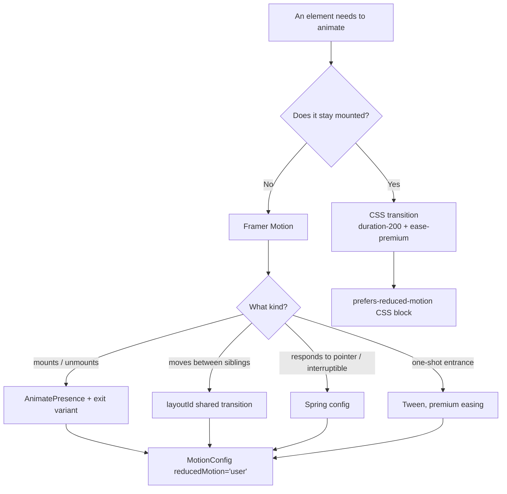

# The PetZu World — Premium Polish Pass

Eighth milestone. An audit-and-refine pass over the whole app rather than
a new feature area. Builds on
[ARCHITECTURE.md](ARCHITECTURE.md) · [DESIGN_SYSTEM.md](DESIGN_SYSTEM.md) ·
[HOMEPAGE.md](HOMEPAGE.md) · [STORE.md](STORE.md) ·
[SERVICES.md](SERVICES.md) · [CONTENT.md](CONTENT.md) ·
[AUTH.md](AUTH.md).

---

## What the audit actually found

Three real defects, not cosmetic preferences. These drove the work:

| # | Finding | Why it mattered |
|---|---|---|
| 1 | **Two competing motion vocabularies.** `constants/animations.ts` (every scroll reveal, on all 99 routes) used generic `ease: "easeOut"`, while `constants/motion.ts` (dialogs, toasts, tabs) used premium cubic-béziers. | Content entrances felt mechanical while UI chrome felt refined — the exact inconsistency that reads as "assembled from parts" rather than designed. |
| 2 | **Reduced-motion was honored in 2 of ~20 animated components.** Only `Magnetic` and `Marquee` checked it. Scroll reveals, parallax, cursor glow, counters, dialogs, floats — none did. | A genuine accessibility defect. A visitor with a vestibular disorder got the full parallax-and-float experience despite explicitly asking their OS not to. |
| 3 | **No skip-to-content link.** | A keyboard user had to tab through the mega menu, search, wishlist, cart, theme toggle and account menu — roughly 20 stops — before reaching content. On every page. |

The fixes were made at the **token and primitive level**, not page by
page — which is why they propagate across all 99 routes without touching
99 files.

---

## 1. Why every animation exists

Each one has a job. Anything that couldn't justify one wasn't added.

| Animation | Job it does |
|---|---|
| **Page transition** (`app/template.tsx`) | Masks the split-second where a route swaps and signals "this is new content," so navigation doesn't feel like a hard cut. |
| **Scroll reveal** (`Reveal` / `RevealGroup`) | Directs the eye to what just entered the viewport and confirms the page is responsive to scrolling. |
| **Stagger** (`staggerContainer` / `staggerItem`) | Turns a grid of 8 cards from one heavy visual "thud" into a readable sequence — the eye follows the cascade instead of being asked to parse everything at once. |
| **Hero mouse parallax** | Depth that responds to input is the one thing a static image can't fake. This is the single strongest "this was crafted" signal on the page. |
| **Cursor glow** (hero) | Ambient light that follows the pointer, giving the section depth even where nothing is interactive. |
| **Magnetic buttons** (primary CTAs) | Makes the highest-value click targets feel more responsive than they physically are. |
| **Animated counters** (stats) | Converts static credibility numbers into a small reward for having scrolled that far. |
| **Marquee** (trusted brands) | Implies an ever-growing roster rather than "eight logos, once." |
| **Floating background blobs** | Keeps large empty areas from reading as flat/unfinished. Pure CSS, GPU-composited, zero JS. |
| **Skeleton shimmer** | Communicates "loading in progress," and — because skeletons are shaped like the content they replace — prevents the layout jump that makes loading *feel* slower than it is. |
| **Brand loader** (route Suspense) | On a slow connection this is the first thing a visitor sees; a generic spinner says "generic software." |
| **Dialog / sheet / toast / accordion / tab-indicator** | Spatial continuity — things enter from where they conceptually come from, so the UI stays legible while it changes. |

**What was deliberately not added:** no scroll-jacking, no full-page
crossfades, no custom cursor replacing the OS cursor, no animated
counters outside the stats block, no entrance animation on dashboard
list rows. Restraint is the actual Apple lesson — their pages animate
*less* than most sites trying to look like them, and each remaining
animation carries more weight for it.

## 2. Why these easing curves

Four curves, one per intent, all defined once in
[`styles/theme.css`](styles/theme.css) and mirrored for JS in
[`constants/motion.ts`](constants/motion.ts):

| Token | Curve | Used for | Why this shape |
|---|---|---|---|
| `premium` | `cubic-bezier(0.16, 1, 0.3, 1)` | Entrances, page transitions, scroll reveals, hovers | A strong expo-out: fast start, long gentle settle. Motion that decelerates into place reads as *arriving* rather than *stopping*. This is the curve doing most of the "premium" work. |
| `snappy` | `cubic-bezier(0.4, 0, 0.2, 1)` | Overlays, backdrops | Symmetric ease-in-out. Backdrops shouldn't call attention to themselves by overshooting or lingering. |
| `smooth` | `cubic-bezier(0.65, 0, 0.35, 1)` | Accordion, loader rings | More gradual on both ends — right for things that expand/contract, where an abrupt start feels like a snap. |
| `bounce` | `cubic-bezier(0.34, 1.56, 0.64, 1)` | Reserved for playful accents | Overshoots past 1 then settles. Used sparingly by design; overshoot everywhere reads as toy-like, not premium. |

**The thing all four have in common: none of them is `linear`, and none
is a symmetric `ease`.** Linear motion is the clearest tell of
un-designed animation, because nothing in the physical world starts and
stops at a constant rate. The one deliberate exception is the brand
marquee, which *must* be linear — any easing on an infinite loop creates
a visible pulse at the loop seam.

**Springs where physics beats a curve.** Toasts, tab indicators, magnetic
buttons and the cursor glow use spring configs, not eased tweens: they
respond to unpredictable input (a pointer position, an interruption), and
a spring handles being interrupted mid-flight gracefully where a
fixed-duration tween snaps.

## 3. Why these durations

```
fast    150ms  — state changes the user already knows about (overlay fade)
base    250ms  — most UI transitions (dialogs, sheets, accordions)
slow    400ms  — page transitions, scale-ins
slower  600ms  — hero entrance, scroll reveals
```

The governing research: **below ~100ms a transition isn't perceived as
motion at all** (it reads as an instant jump), and **above ~400ms the
user starts waiting on it.** Everything interactive therefore sits in
the 150–400ms band.

The two values above 400ms are deliberate exceptions, and both are
non-blocking: the hero entrance plays once on arrival while the visitor
is still orienting, and scroll reveals play on content the user is
scrolling *toward* — in both cases nothing is gated behind the animation
finishing.

**Stagger is 70ms per item, not 150ms.** With 8 cards, 150ms would mean
1.2 seconds before the last one appears — long enough that a fast
scroller sees a half-empty grid. 70ms keeps the whole cascade under
600ms while still reading as sequential.

Hover feedback is **200ms** — quick enough to feel instant, slow enough
to be a transition rather than a flicker.

## 4. Why these hover effects

The rule applied throughout: **hover must change something a user
believes they caused, without changing layout.**

| Element | Effect | Reasoning |
|---|---|---|
| Primary/gradient buttons | Shadow deepens, slight lift | Reinforces "pressable and important." Notably *not* a size change — scaling a button reflows its neighbours. |
| Cards (product, provider, article, service) | `-translate-y-1` + shadow to `xl` | Lifting toward the cursor is the most legible "this is a surface you can press" metaphor. Transform-only, so it never triggers layout. |
| Category tiles | Icon scales 1.1×, border tints primary | Two small simultaneous signals read as more considered than one large jump. |
| Product cards | Wishlist heart fades in, cart button inverts | Progressive disclosure — secondary actions appear only when relevant, keeping the resting card clean. |
| Blog cards | Title shifts to `text-primary` | For a card whose content *is* the headline, colour alone is sufficient; adding a lift would be redundant. |
| Nav / mega-menu triggers | `muted-foreground` → `foreground`, chevron rotates 180° | The rotation doubles as an open/closed state indicator, not just decoration. |
| Icon-with-arrow patterns | Arrow nudges 2–4px in its pointing direction | Every instance app-wide uses the same direction and easing — consistency is what makes it read as a system. |

**Every hover animates `transform`, `opacity`, `box-shadow` or `color`
— never `width`, `height`, `top`, or `margin`.** See §8.

## 5. Animation psychology

- **Perceived performance beats measured performance.** A skeleton
  shaped like the incoming content makes a 400ms load feel shorter than
  a spinner does, because the user's eye has already begun parsing
  layout. Nothing got faster; the waiting got easier.
- **Motion creates causality.** When a drawer slides in from the right
  edge after you click a cart icon on the right, the interface has
  explained where the panel came from and where it will return. A
  cross-fade in the same situation leaves it spatially unexplained.
- **Anticipation reduces perceived latency.** A button that responds
  within ~100ms of hover (before any click) has already told the user
  "this is interactive and I'm listening," so the subsequent wait feels
  like *their* action in progress rather than the system stalling.
- **Deceleration reads as intent, acceleration reads as escape.** The
  expo-out `premium` curve settles rather than stops, which is why the
  same 400ms move feels considered with it and abrupt without it.
- **Sequence conveys hierarchy.** Staggered entrance tells the eye a
  reading order for free — the same information a designer would
  otherwise have to communicate with size or weight.
- **Diminishing returns are real.** An animation that delights on the
  first view is a tax by the twentieth. This is precisely why the page
  transition is 8px and 400ms rather than a dramatic slide: it's the one
  animation a visitor sees on *every single* navigation.

## 6. Premium UX principles applied

1. **One motion vocabulary.** Four easing tokens and four durations, used
   everywhere. The single biggest change this milestone made was
   collapsing two vocabularies into one (audit finding #1).
2. **Nothing hardcoded.** No raw hex, no magic pixel values for spacing
   or type, no inline easing strings. A rebrand or a timing change is a
   one-file edit — the property that separates a design *system* from a
   pile of styled components.
3. **Restraint as a feature.** Listed explicitly in §1 under "deliberately
   not added."
4. **Honest placeholders.** No stock photography, no fake logo images, no
   map that pretends to be Google Maps, no OAuth button that pretends to
   work. Every placeholder in this project is visibly a placeholder —
   which ages better and signals more confidence than convincing fakery.
5. **Consistency over novelty.** Every product/provider/article card uses
   the same construction. A user who learns one grid has learned all of
   them.
6. **The details nobody names.** `scroll-padding-top` so anchor jumps
   clear the sticky navbar; `scrollbar-gutter: stable` so opening a
   dialog doesn't shift the page sideways; `overflow-wrap` so a long URL
   can't blow out a mobile column. Individually invisible; collectively
   the difference between "polished" and "not."

## 7. Motion accessibility

The headline fix of this milestone, addressing audit finding #2.
Coverage went from 2 components to **global**, via two complementary
mechanisms:

**JavaScript half** — `<MotionConfig reducedMotion="user">` in
[`components/providers/motion-provider.tsx`](components/providers/motion-provider.tsx)
wraps the entire app. Every Framer Motion animation now honors the OS
setting automatically, and a component *cannot* forget to opt in.

Critically, `reducedMotion="user"` disables **transform and layout**
animations while **letting opacity fades continue**. That distinction is
the correct interpretation of the spec: `prefers-reduced-motion` exists
for vestibular disorders, which are triggered by *movement*, not by
things fading. Removing all animation would be an over-correction that
makes the interface feel broken rather than accessible.

**CSS half** — a `@media (prefers-reduced-motion: reduce)` block in
[`app/globals.css`](app/globals.css) catches everything Framer never sees:
`animate-float`, the skeleton shimmer, accordion height keyframes, and
every `transition-*` hover utility. Durations collapse to `0.01ms`
rather than `animation: none`, because some components depend on
transition/animation *end* events firing — `none` can prevent them from
ever completing.

Also shipped this pass:

- **Skip-to-content link** — `sr-only` until focused, then pinned
  top-left (audit finding #3).
- **One global `:focus-visible` treatment** — a 2px ring in the brand
  colour with proper offset, applied to any interactive element that
  doesn't define its own. Verified it does *not* double up with
  `Button`'s existing ring: `.outline-none` sits in Tailwind's utilities
  layer and correctly wins over the base-layer rule.
- **`:focus-visible`, never `:focus`** — so pointer users never see a
  ring they didn't ask for, while keyboard users always do.
- **All decorative motion is `aria-hidden`** — the floating background,
  loader rings, and progress bar are atmosphere, and announcing them
  would be noise. The brand loader carries `role="status"` +
  `aria-live="polite"` with a real text label instead.

## 8. Performance optimization

- **Only compositor-friendly properties are animated** — `transform`,
  `opacity`, `box-shadow`, `color`. Never `width`, `height`, `top`, or
  `margin`, which force layout recalculation on every frame and are the
  usual cause of janky "premium" animation.
- **CSS for anything that stays mounted; Framer only for what CSS can't
  express** (exit animations, shared layout, spring physics, scroll
  linkage). The floating background and skeleton shimmer are pure CSS —
  zero JS cost.
- **Syntax highlighting runs on the server.** Shiki highlights at build
  time and ships plain HTML with inline colours; no grammars, themes, or
  WASM reach the client.
- **Counters write to the DOM directly.** `AnimatedCounter` subscribes to
  its spring via `.on("change")` and sets `textContent` rather than
  calling `setState` — a value ticking through React state would
  re-render the tree ~60×/second for one number.
- **Scroll work uses the right browser primitive.** The TOC scroll-spy
  uses `IntersectionObserver` rather than a scroll listener recomputing
  positions every pixel; the reading-progress bar uses Framer's
  `useScroll` (rAF-batched), not a raw handler.
- **Reveals fire once** (`viewport={{ once: true }}`) — re-animating on
  every scroll-by is both distracting and needless work.
- **Static generation wherever possible.** Of 99 routes, the large
  majority are prerendered at build time.
- **Pointer-driven effects bail out early** — `Magnetic`, `CursorGlow`
  and the hero parallax all check `pointerType !== "mouse"` and return
  immediately, so touch devices never run pointer math.

## 9. Compared with Apple and Framer

**Where this genuinely matches them**

- Easing philosophy — expo-out deceleration is the shared house curve of
  Apple's marketing pages, Linear, and Framer's own site.
- Duration discipline — the 150/250/400ms band is close to what all three
  operate within.
- Product-as-visual — the hero illustration is built from the design
  system's own tokens rather than photography, which is exactly Framer's
  and Stripe's approach.
- Restraint — fewer animations, each carrying more weight.

**Where this deliberately differs**

- **Apple scroll-jacks; this doesn't.** Apple product pages frequently
  take over scroll to drive a cinematic sequence. That works when the
  page *is* the story. PetZu is a transactional site where people need
  to reach a product or a booking, and taking scroll away from someone
  trying to get somewhere is hostile.
- **Framer animates more, because motion is their product.** Framer's
  site is a demo of what Framer can do, so maximalism is on-brand there
  and would be noise here.
- **No bespoke cursor.** Both references sometimes replace the OS cursor.
  This project scopes a cursor *glow* to the hero instead — you get the
  atmosphere without breaking the native affordances a cursor carries.

**The honest gaps**

Apple ships bespoke per-page art direction with dedicated motion
designers, real product photography and video, and per-frame-tuned
scroll sequences. This project has a consistent system applied
uniformly — which is the right target for a real product, but it is a
different thing from bespoke art direction, and claiming parity there
would be dishonest.

## 10. Notes

### What changed in this pass

```
constants/animations.ts        rewritten — now sources easing/duration from motion.ts
components/providers/
  motion-provider.tsx          NEW — MotionConfig reducedMotion="user", global
  index.tsx                    wires MotionProvider into the provider root
app/globals.css                + reduced-motion block, global :focus-visible,
                               scroll-padding-top, scrollbar-gutter, overflow-wrap
components/layout/skip-link.tsx  NEW
app/layout.tsx                 + SkipLink, + id="main-content" on <main>
app/template.tsx               NEW — page transitions (template, not layout)
components/motion/
  page-transition.tsx          NEW
  floating-background.tsx      NEW — extracted from 3 hand-rolled copies
  brand-loader.tsx             NEW — replaces the generic loading spinner
components/ui/skeleton.tsx     animate-pulse → directional shimmer sweep
styles/animations.css          + --animate-shimmer token and keyframe
features/home/components/hero.tsx        uses FloatingBackground
features/auth/components/auth-shell.tsx  uses FloatingBackground
app/loading.tsx                uses BrandLoader
```

### Motion decision flow



### Verification

`npm run build` and `npm run lint` pass clean across all **99 routes**.
Verified against the running server:

- Skip link renders in HTML with correct `sr-only` → `focus:not-sr-only` classes; `<main id="main-content">` present.
- `@media (prefers-reduced-motion: reduce)` block compiled into the served CSS with all four declarations intact.
- Global `:focus-visible { outline: 2px solid var(--color-ring) }` compiled; confirmed `.outline-none` sits later in the cascade so `Button` keeps its ring with **no doubled outline**.
- `@keyframes shimmer` and `scrollbar-gutter` present in served CSS.
- Regression spot-check across all seven route families (home, shop, blog article with code block, services, sign-in, FAQ, dashboard) — all render correctly.
- Zero server errors.

As in prior milestones, the interactive motion itself (parallax
responding to the pointer, the page transition playing on navigation,
the shimmer sweeping) was **not** visually confirmed in this session —
the browser pane is non-composited here, which pauses
`requestAnimationFrame`, a limitation documented since
[STORE.md](STORE.md). The logic, CSS, and markup are verified; the
motion is worth a look in a normal browser tab.
