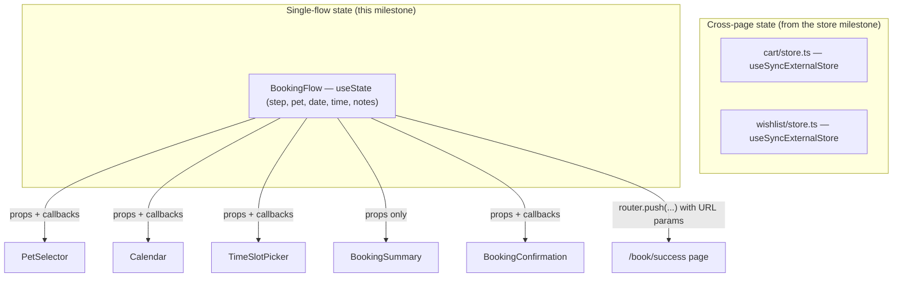
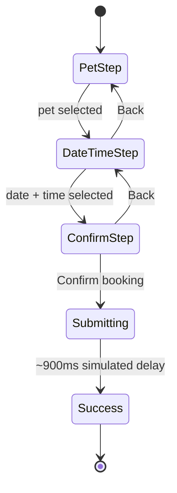
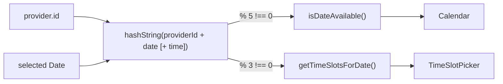

# The PetZu World — Services Module

Fifth milestone. Vet and groomer booking on top of the foundation
([ARCHITECTURE.md](ARCHITECTURE.md)), design system
([DESIGN_SYSTEM.md](DESIGN_SYSTEM.md)), homepage
([HOMEPAGE.md](HOMEPAGE.md)), and store ([STORE.md](STORE.md)).
**Frontend only** — 12 providers, deterministic (not random) availability,
and a booking flow that ends in a real, downloadable calendar file with no
backend behind any of it.

---

## 1. Why this booking flow?

Three steps — **Pet → Date & time → Confirm** — because that's the actual
dependency order of the decision, not an arbitrary split:

1. **Pet** has to come first because it determines *nothing* about
   availability, so asking it up front costs nothing and lets the flow
   personalize immediately ("Notes for Dr. Reyes" reads differently once
   you know it's about Biscuit).
2. **Date & time** are paired in one step, not two, because they're not
   independent — the whole point of showing a calendar is to reveal which
   times are open *for the date you're looking at*. Splitting them into
   separate steps would mean picking a date blind, then discovering on the
   next screen that nothing's available.
3. **Confirm** is last and irreversible-feeling on purpose — it's the only
   step with a real commit action (and the only one that takes a moment,
   simulating submission), so it needs to be the point of no accidental
   return.

The stepper header lets you jump *backward* to any completed step (to
change the pet or the date) but not forward past where you've gotten —
you can't confirm a booking for a time slot you haven't picked yet. That
asymmetry is what actually prevents invalid bookings, not form validation
after the fact.

## 2. Why this calendar design?

- **A month grid, not a list of the next 14 days.** A grid communicates
  "this is a real calendar you can navigate" and lets a shopper book two
  or three weeks out without a scrolling list. Next/previous month
  controls keep it from feeling like a dead end.
- **Availability is a dot, not a color-fill.** A small green dot under an
  available date (vs. a line-through for unavailable, vs. muted for past)
  keeps the grid legible — a fully color-coded calendar gets visually
  loud fast; a subtle dot reads as "extra information," not decoration.
- **Deterministic, not random, availability.** `isDateAvailable` and
  `getTimeSlotsForDate` hash the provider id + date (+ time) into a stable
  pseudo-random result — the *same* date always shows the *same*
  availability on every render and every visit. Real `Math.random()`
  would make the calendar flicker between different "available" states on
  every re-render, which reads as broken, not dynamic.
- **No date-picker dependency.** The entire calendar is ~40 lines of plain
  `Date` math (`getMonthMatrix`, `addMonths`, `isSameDay`). The one thing
  the app needs — a month grid with click-to-select — didn't justify
  pulling in a library; see §7 for the general "own it if it's small"
  principle this follows throughout the project.

## 3. Why these service cards?

`ProviderCard` follows the exact same construction as the store's
`ProductCard` ([STORE.md](STORE.md) §2) — a full-cover `Link` layered
*behind* the interactive "Book now" button — because it's the same
underlying problem (a grid of clickable-everywhere cards with one
escape-hatch action) wearing different content. Specific choices for
*this* domain:

- **Verified badge is inline with the name**, not a separate row — trust
  signals for a healthcare-adjacent booking need to be seen in the same
  glance as the name, not discovered a scroll later.
- **Specialties are capped at 2 + "N more"**, not all shown. A groomer
  with 4 specialty tags would otherwise push price/CTA below the fold on
  a 3-column grid; capping keeps every card the same visual weight.
- **Distance replaces a generic "location" line** ("1.8 mi" / "Comes to
  you" for mobile groomers) — for a service you might visit in person,
  distance is more decision-relevant than a city name alone.
- **Glass card variant**, not the flat default — services/booking is the
  one part of the app closest to "premium concierge," so the card
  material itself leans into that (see DESIGN_SYSTEM.md's `glass`
  utility) more than the store's plainer product cards do.

## 4. Why this provider detail page?

A single-column profile + sticky booking rail, structured in the order a
patient actually evaluates a provider: **who they are** (name, credentials,
photo-substitute avatar) → **can I trust them** (rating, verified badge,
years of experience, languages) → **what do they actually do** (bio,
specialties) → **what will it cost and take** (itemized services with
duration and price) → **can I book them right now** (the sticky CTA,
which is the *only* place price and availability status repeat, so it's
never more than a glance away regardless of scroll position).

Each service line item has its **own** "Book" button (not just one global
"Book appointment" CTA) because different services from the same provider
can have meaningfully different durations and prices (a $220 dental
cleaning vs. a $75 dental exam) — collapsing them into one generic CTA
would force an extra "which service?" step into the booking flow itself.
Clicking a specific service's Book button carries that choice straight
into step 2 of the flow via `?service=<id>`.

**Waitlist providers are handled at three levels**, not just visually:
the sticky CTA and every service row render a disabled "Waitlist" button
instead of a link; the `/book` route itself calls `notFound()` if
`acceptsNewPatients` is false (so the restriction can't be bypassed by
typing the URL directly); and `generateMetadata` matches that same check
so even the page *title* doesn't leak into a stray link preview.

## 5. Component communication

Two different communication patterns exist side by side in this
milestone, deliberately:



**Why `BookingFlow` uses plain lifted `useState`, not a global store like
cart/wishlist:** a booking is a single, disposable, one-shot interaction —
nothing outside this one page tree ever needs to read "what date is
currently selected." Lifting state to the nearest common ancestor
(`BookingFlow`) and passing it down as props/callbacks is simpler, doesn't
need `localStorage` persistence, and doesn't leak state across unrelated
page visits (you *don't* want your in-progress date selection to survive
a navigation away and back — a `useSyncExternalStore` module store would
do that, wrongly).

**Why the success page gets its data from URL params, not the flow's
state directly:** `router.push` is a full navigation to a new page/route
— React state doesn't survive that. Passing `service`, `pet`, `date`, and
`time` as query parameters is the same mechanism the store checkout uses
implicitly (cart persists to `localStorage` instead, since a cart *should*
survive navigation) — here, encoding the final answer directly in the URL
is simpler than standing up a store for data that's read exactly once.

## 6. Reusable architecture

| Component | Reused by |
|---|---|
| `ProviderCard` / `ProviderGrid` | Both listing pages, and the map-view pin tooltips reference the same provider data |
| `ProviderListing` | Vet listing *and* groomer listing pages — identical search/filter/sort/map engine, different input data (`getProvidersByType("vet")` vs `"groomer"`) |
| `ProviderSearch` | `ProviderListing` (used by both listing pages) |
| `ProviderFilters` | Desktop sidebar *and* the mobile `Sheet` — same component, two containers (same pattern as the store's `FiltersPanel`) |
| `Calendar` / `TimeSlotPicker` | `BookingFlow` step 2 — built as standalone, prop-driven components specifically so a future "reschedule" flow could reuse them without depending on the rest of the booking wizard |
| `BookingSummary` | `BookingFlow`'s sidebar — structurally identical role to the store's `OrderSummary` |
| `BookingReference` / `AddToCalendarButton` | The success page — same lazy-client-value pattern as the store's `OrderNumber` |

Every new **design-system-level** primitive this milestone needed
(`Checkbox`, `Select`, `Sheet`) already existed from the store milestone —
this module added **zero** new dependencies and **zero** new base UI
primitives, which is itself evidence the design system generalized
correctly the first time.

## 7. Scalability

- **Adding a third provider type** (e.g. "trainer") is additive: one more
  `ProviderType` union member, one more `specialtiesByType` entry, a new
  `/services/training/page.tsx` that's a ~15-line copy of
  `vet-booking/page.tsx` swapping `getProvidersByType("trainer")` in.
  Nothing in `ProviderListing`, `ProviderCard`, or the booking flow needs
  to know a third type exists.
- **Swapping deterministic availability for a real scheduling API** means
  replacing the bodies of exactly two functions — `isDateAvailable` and
  `getTimeSlotsForDate` in `features/services/utils.ts` — with real fetch
  calls. `Calendar` and `TimeSlotPicker` call them through the same
  signature either way, so neither component would change.
- **A real map** replaces `MapPlaceholder`'s internals only; it already
  receives exactly the prop shape (`providers: Provider[]`) a real map
  integration would need for markers.
- **The booking flow scales to more steps** without restructuring —
  `BookingStepper` takes a step count and current index, `BookingFlow`'s
  step content is a simple `step === n` switch. Inserting an "Insurance
  info" step between Pet and Date would be one more case, one more array
  entry in `STEPS`, no architectural change.

## 8. Accessibility decisions

- **The calendar is a real grid**, not a list of unlabeled buttons —
  `role="grid"`/`role="gridcell"` plus `aria-label` on each date
  (`date.toDateString()`, so screen readers hear "Tuesday, January 14,
  2026," not just "14") and `aria-selected` on the chosen date.
- **Disabled means disabled, not just styled dim.** Past dates, unavailable
  dates, and unavailable time slots all set the real `disabled` attribute
  — not just a muted class — so they're unreachable by keyboard tab order
  and correctly announced as unavailable, not silently skipped.
- **The stepper's future steps are genuinely unclickable** (`disabled`),
  not just visually deemphasized, so keyboard/screen-reader users can't
  tab into a step whose prerequisites aren't met.
- **Waitlist-only providers get a real disabled `<Button>`**, not a
  `Button asChild` wrapping a `Link` with a `disabled` prop bolted on —
  the earlier design-system note about `asChild` + `disabled` not working
  on anchors (see DESIGN_SYSTEM.md) applied directly here, and this
  milestone follows that same fix.
- **Every icon-only control has an `aria-label`** — the verified badge,
  the map pins (`title` + accessible name), the list/map toggle buttons,
  the calendar's prev/next month buttons.
- **The search combobox** sets `role="combobox"` and `aria-expanded` on
  the input, matching the ARIA pattern for a text input with a live
  suggestion list, and is fully operable via `ArrowUp`/`ArrowDown`/`Enter`/`Escape`
  — not mouse-only.

## 9. Compared to enterprise healthcare websites

- **Zocdoc's core insight — search by symptom/specialty, not just
  provider name — is mirrored** in `ProviderSearch` matching against
  specialties, not just names, and in the specialty-based filter facets.
  Zocdoc made "I don't know which doctor, I know what's wrong" a
  first-class search path; this module does the same for "I don't know
  which vet, I know my dog needs a dental cleaning."
- **Real-time slot availability** (Zocdoc, athenahealth's patient portal)
  is the single feature that separates a "contact us to schedule" page
  from a real booking product — this module's calendar-with-dots +
  time-slot grid is a direct, if data-mocked, analog.
- **The "accepting new patients" flag** is a real pattern from healthcare
  directories (most insurance-network provider search tools surface this
  exact status) — it's the single most important piece of information a
  detail page can show *before* someone invests time picking a date.
- **A visible, itemized price list per service** is actually *more*
  transparent than most real healthcare booking sites, which frequently
  hide pricing behind "contact for a quote." That was a deliberate choice
  here, not an oversight — for a consumer pet-care product (as opposed to
  insurance-mediated human healthcare), showing price upfront is a
  trust-builder, not a liability.
- **The honest gap**: no real identity verification, no insurance/payment
  integration, no HIPAA-equivalent data handling, no real-time
  double-booking prevention across concurrent users — all backend
  concerns this frontend-only milestone doesn't (and shouldn't yet)
  attempt to fake.

## 10. Notes

### Route map

```
/services/vet-booking                              → Vet Listing (6 vets)
/services/grooming                                  → Groomer Listing (6 groomers)
/services/providers/[slug]                          → Provider Detail
/services/providers/[slug]/book                     → Booking Flow (3-step)
/services/providers/[slug]/book/success              → Booking Success
```

### Booking flow state machine



### Data flow for availability



Same inputs always produce the same output — no `Math.random()`, no
hydration mismatches, no calendar that shows different open dates on
refresh.

### Verification

`npm run build` and `npm run lint` pass clean across all 69 routes (12
provider pages + 2 listings + booking + success, statically generated
where possible, dynamically rendered where `searchParams` require it).
Every route's server-rendered HTML was verified via direct HTTP request,
including edge cases: an invalid provider slug correctly renders "This
page could not be found," and a waitlist-only provider's `/book` route
correctly 404s rather than allowing a booking to start. As with the
previous two milestones, full client-side interaction (clicking through
the calendar, submitting a booking) was not visually verified in this
session due to the same non-composited-browser-pane limitation documented
in [STORE.md](STORE.md) — worth a click-through in a normal browser tab.
