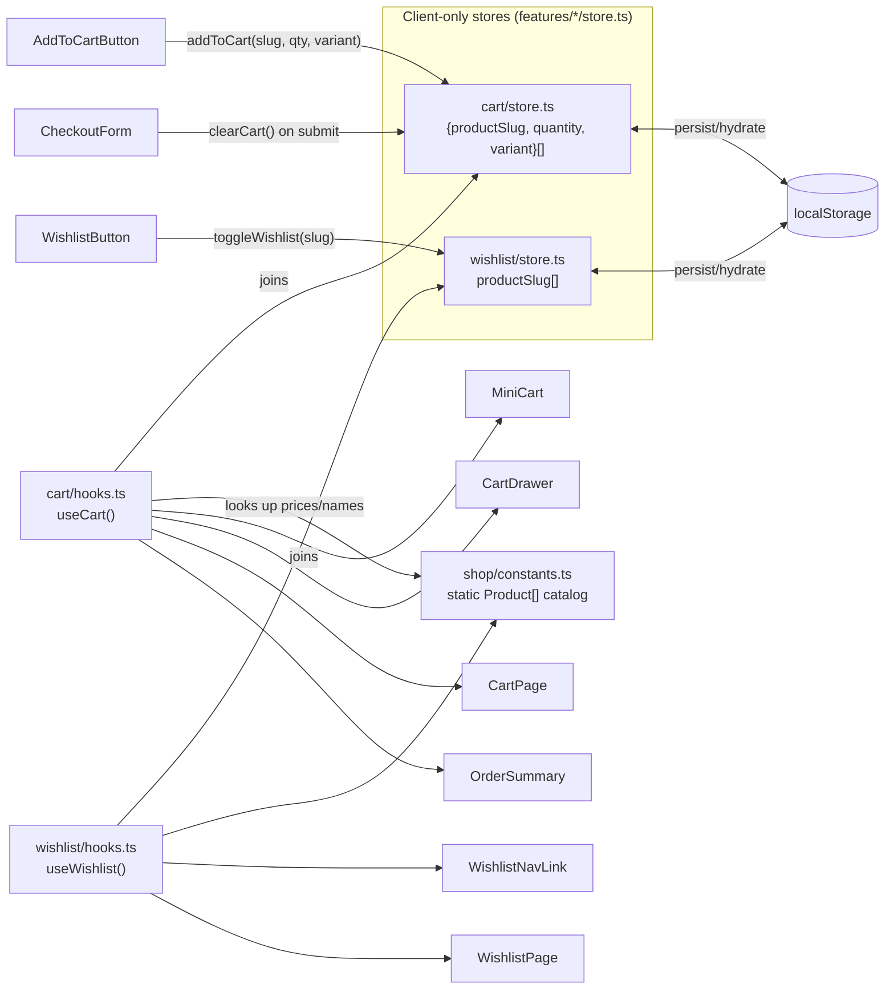

# The PetZu World — Store Experience

Fourth milestone. Builds the full ecommerce flow on top of the foundation
([ARCHITECTURE.md](ARCHITECTURE.md)), design system
([DESIGN_SYSTEM.md](DESIGN_SYSTEM.md)), and homepage
([HOMEPAGE.md](HOMEPAGE.md)). **No backend** — cart and wishlist are
client-side state persisted to `localStorage`; checkout is a UI-only
simulation. All 16 products, filters, and page copy live in
[features/shop/constants.ts](features/shop/constants.ts).

---

## 1. Why this ecommerce flow?

The flow mirrors the shape every real storefront converges on, because
it's the shape that matches how shoppers actually decide:

```
Browse (listing/category/search) → Evaluate (card → quick view → detail)
  → Commit (add to cart) → Review (drawer/cart page) → Purchase (checkout)
  → Confirm (success)
```

Two branch points exist deliberately: **Quick View** lets a shopper
evaluate a product without leaving the grid (low commitment), while
**Product Detail** is for shoppers who need variant selection, full
policy details, or related-product browsing (high commitment). Forcing
every product interaction through a full page load would cost the
low-commitment majority extra friction for no benefit; only offering
Quick View would lose the shoppers who need more information before
buying. Wishlist exists as a *third*, no-commitment path — save now,
decide later — which is what actually reduces cart abandonment in real
storefronts (a wishlist item isn't a lost sale, it's a deferred one).

## 2. Why these product cards?

[`ProductCard`](features/shop/components/product-card.tsx) is the single
component behind listing, category, search, related products, and the
wishlist page — deliberately, not by coincidence. A few decisions:

- **The whole card is clickable, not just the title.** A full-cover `Link`
  sits *behind* the interactive controls (wishlist heart, quick view,
  add-to-cart) via z-index layering — clicking anywhere navigates except
  those specific escape-hatch buttons. This is the standard ecommerce
  pattern (Amazon, Shopify default themes) because it removes the
  precision cost of hunting for a specific "clickable" title.
- **Add-to-cart is always visible, not hover-revealed.** Hover-only
  affordances fail outright on touch devices, which is most ecommerce
  traffic. Wishlist and quick view *are* hover-revealed on desktop (with
  the wishlist heart staying visible once active) because they're
  secondary actions; add-to-cart is the primary one and never hides.
- **Consistent visual grammar everywhere.** Same badge placement, same
  rating treatment, same price formatting — a shopper's pattern-matching
  from the listing page carries directly into related products without
  re-learning a new layout.

## 3. Why this checkout UX?

**Single page, not a multi-step wizard.** A stepper (shipping → payment →
review, each its own screen) adds navigation overhead and a state machine
to manage; a single scrolling form with a sticky order-summary rail is
exactly what Stripe Checkout and Shopify's modern checkout converged on,
because it lets a shopper see the whole commitment (form + total) at once
instead of trusting that later steps won't surprise them.

**The order summary never leaves view.** It's `sticky`/anchored in the
right rail throughout scroll — the total is the single most
anxiety-relevant number in the entire flow, so it's never more than a
glance away.

**Explicitly labeled as a demo.** "Demo checkout — no real payment is
processed" sits directly above the card fields. Building a checkout form
that *looks* like it collects real payment info without saying so would
be actively misleading; saying so costs nothing and matches this
project's "no backend" constraint honestly.

**A believable processing delay.** Submitting doesn't redirect instantly
— a ~900ms simulated delay (button reads "Placing order...") stands in
for the real network round-trip a payment call would take. Instant
redirects read as fake; a brief, honest pause reads as real.

## 4. Why this cart interaction?

Two surfaces, not one, because they answer different questions:

- **`MiniCart`** (navbar icon + live count badge) answers "do I have
  anything in my cart right now" from *anywhere* on the site, at a glance,
  with zero clicks.
- **`CartDrawer`** (the slide-over `Sheet` it opens) answers "what
  exactly is in it, and can I fix it" — full line items, quantity
  steppers, remove buttons, subtotal — without leaving the page you were
  on. This is the "don't lose my place" principle: adding one more item
  from a product page shouldn't cost you your scroll position.
- **`/cart`** (the full page) exists for the cases a drawer is too small
  for — someone who wants to review a large order deliberately, or who
  landed on `/cart` directly from a bookmark or link.

All three read from the *same* store ([features/cart/store.ts](features/cart/store.ts)),
so an add-to-cart action anywhere is instantly reflected everywhere —
there's exactly one source of truth, never three copies to keep in sync.

## 5. Why these filters?

Five facets, chosen because they're the ones that actually narrow a
pet-supply catalog the way a shopper thinks about it:

- **Pet type** — the first, most natural narrowing question ("I have a
  dog") — also doubles as the category page's implicit filter.
- **Category** — food vs. toys vs. beds vs. gear vs. health, the second
  most natural axis, orthogonal to pet type.
- **Price buckets** (not a slider) — four fixed ranges, chosen over a
  draggable range slider because bucketed price filters are faster to
  scan and tap (especially on mobile) than dragging two slider handles
  precisely, and they match how Amazon, Etsy, and most large retailers
  actually implement price filtering.
- **Rating** ("4★ & up" / "3★ & up") — a single-click quality bar,
  not a 5-way exact-rating picker nobody actually wants.
- **In stock only** — a single checkbox for the one binary that matters
  when a shopper is ready to buy *now*.

All filters are **multi-select and combinable**, computed client-side via
one pure function ([`filterProducts`](features/shop/utils.ts)) — there's
no server round-trip per filter click, so the grid updates instantly.

## 6. Every reusable component, explained

| Component | Reused by | Job |
|---|---|---|
| [`ProductCard`](features/shop/components/product-card.tsx) | Listing, category, search, related products, wishlist | The one product tile — see §2 |
| [`ProductGrid`](features/shop/components/product-grid.tsx) | Listing, category, search, wishlist | Grid layout + shared empty state ("no products match") |
| [`ShopListing`](features/shop/components/shop-listing.tsx) | Listing, category, search pages | Owns filter/sort state, composes `FiltersPanel` + `Toolbar` + `ProductGrid` — the one interactive engine all three "browse" pages share |
| [`FiltersPanel`](features/shop/components/filters-panel.tsx) | Desktop sidebar *and* mobile `Sheet` | One filter UI, two containers — never diverges between breakpoints |
| [`SortSelect`](features/shop/components/sort-select.tsx) | `Toolbar` | Styled `Select` wrapper bound to the 4 sort options |
| [`Toolbar`](features/shop/components/toolbar.tsx) | `ShopListing` | Result count + sort + mobile filters trigger |
| [`QuickViewTrigger`](features/shop/components/quick-view-dialog.tsx) | `ProductCard` | Self-contained hover affordance + its own `Dialog` — no parent state needed |
| [`ProductDetail`](features/shop/components/product-detail.tsx) | Product page | Variant swatches, quantity, add-to-cart, trust badges, accordion details |
| [`RelatedProducts`](features/shop/components/related-products.tsx) | Product page | Thin wrapper around `ProductGrid` fed by [`getRelatedProducts`](features/shop/utils.ts) |
| [`AddToCartButton`](features/shop/components/add-to-cart-button.tsx) | Card, quick view, product detail | Icon-swap-to-checkmark confirmation, shared everywhere an add-to-cart action exists |
| [`WishlistButton`](features/shop/components/wishlist-button.tsx) | Card, quick view, product detail | `floating` (image overlay) and `inline` (labeled row) variants of the same toggle |
| [`MiniCart`](features/cart/components/mini-cart.tsx) / [`CartDrawer`](features/cart/components/cart-drawer.tsx) / [`CartLineItem`](features/cart/components/cart-line-item.tsx) | Navbar / drawer / drawer + `/cart` page | See §4 |
| [`WishlistNavLink`](features/wishlist/components/wishlist-nav-link.tsx) / [`WishlistContent`](features/wishlist/components/wishlist-content.tsx) | Navbar / `/wishlist` page | Same badge-count pattern as the cart, feeding `ProductGrid` |
| [`OrderSummary`](features/checkout/components/order-summary.tsx) | `/checkout` page | Live cart recap + shipping/tax/total math |
| **New design-system primitives**: [`Checkbox`](components/ui/checkbox.tsx), [`Select`](components/ui/select.tsx), [`Sheet`](components/ui/sheet.tsx), [`Rating`](components/ui/rating.tsx), [`QuantityStepper`](components/ui/quantity-stepper.tsx) | Across all of the above | Added to the shared design system (not `features/shop`) because none of them are store-specific — a future settings page or blog comment form could use `Checkbox`/`Select` just as easily |

`Sheet` is worth calling out specifically: it's the *same* Radix Dialog
primitive as the existing `Dialog` component, just animated as a
slide-in side panel instead of a centered scale-fade. Rather than
duplicating the controlled-`open`/`trigger`-prop pattern (and its earlier
bug-fix — see [DESIGN_SYSTEM.md](DESIGN_SYSTEM.md)'s closing note), `Sheet`
reuses that exact API shape, which is why the cart drawer and mobile
filters panel both "just worked" once `Sheet` existed.

## 7. State flow



The store itself never holds product data — only `{productSlug, quantity,
variant}`. Every hook that needs a product's name/price/image looks it up
fresh from the static catalog via [`getProductBySlug`](features/shop/utils.ts).
This is deliberate: **the persisted cart never goes stale**. If a price
changed in `constants.ts` between one session and the next, a returning
visitor's cart reflects the *current* price, not a snapshot from when they
added it — the same behavior a real backend-driven cart would have,
achieved here without a backend at all.

**Why `useSyncExternalStore` instead of `useState`/Context?** Cart and
wishlist need to be read and mutated from components with no shared
ancestor (a `ProductCard` deep in a grid, the navbar's `MiniCart`, the
checkout page) without wrapping the whole app in a cart Context provider
that re-renders on every mutation. A module-level store + `useSyncExternalStore`
(the same pattern already used for the toast system — see
[DESIGN_SYSTEM.md](DESIGN_SYSTEM.md)) lets any component subscribe
directly, and `addToCart()`/`toggleWishlist()` are plain functions
importable from anywhere — no provider, no prop drilling, no context
re-render cascades.

**Why a `Product`'s icon is `iconKey: string`, not `icon: LucideIcon`:**
this was a real bug caught during this milestone's build verification.
Listing/category pages are Server Components (the catalog is static data,
so there's no reason to ship them as client bundles); they pass `Product`
objects as props into client components like `ProductCard`. React Server
Components cannot serialize function values (a component reference) across
that server→client boundary — passing `icon: HomeIcon` directly threw
`Functions cannot be passed directly to Client Components`. The fix:
products carry a string `iconKey` ("home", "utensils", ...), and only
client code resolves it to the actual icon via a `productIcons` lookup map
— the `Product` type is now fully serializable, so it can cross that
boundary freely.

## 8. Scalability

- **Swapping in a real backend touches exactly two files per domain.**
  `features/shop/utils.ts`'s `getProductBySlug`/`filterProducts` and
  `features/cart/store.ts`'s persistence functions are the only places
  that would change from "read/write a local array" to "call an API" —
  every component downstream (`ProductCard`, `CartDrawer`, `useCart`,
  etc.) is written against the *shape* of the data, not its source.
- **The catalog scales past 16 products without a rewrite.** `filterProducts`/
  `sortProducts` are plain array operations; at real-catalog scale (thousands
  of SKUs) the identical logic moves server-side (a `WHERE`/`ORDER BY`
  query) behind the same function signatures, and `ShopListing` wouldn't
  need to change — only how it fetches its initial `products` prop would.
- **New product facets are additive, not structural.** Adding a "brand"
  filter means: one new field on `Product`, one new `FilterSection` in
  `FiltersPanel`, one new condition in `filterProducts`. Nothing else in
  the component tree needs to know.
- **New pages reuse, don't duplicate.** A future "deals" page or
  "new arrivals" page is `<ShopListing products={someFilteredSubset} />`
  inside a new route file — the entire filter/sort/grid/empty-state engine
  comes for free.
- **The cart/wishlist store scaling path is well-trodden.** Swapping
  `localStorage` for a real backend (sync on login, merge guest cart into
  account cart) is a persistence-layer change inside `store.ts` — the
  public API (`addToCart`, `useCartItems`, ...) doesn't need to change,
  so no consuming component would need to be touched.

## 9. How Amazon and Shopify solve similar problems

- **Amazon's filter sidebar** is exactly the bucketed-price + checkbox-facet
  pattern used here — Amazon abandoned exact-range sliders for search
  refinement over a decade ago for the same reason: buckets are faster to
  scan and tap than dragging a precise range.
- **Amazon's "Buy Now" vs. "Add to Cart" split** mirrors this project's
  Quick-View-vs-Detail-page split conceptually: a fast path for shoppers
  who've already decided, a fuller path for shoppers who haven't.
- **Shopify's default themes** popularized the "cart drawer over cart page"
  pattern this project uses as the *primary* cart surface — because a page
  navigation to review a cart interrupts browsing momentum, while a drawer
  doesn't. Shopify still ships a `/cart` page as a fallback, which is
  exactly the three-surface (mini/drawer/page) structure built here.
- **Shopify Checkout / Shop Pay** converged on the same single-page,
  sticky-summary checkout layout described in §3 — multi-step wizards
  used to be the default (including Shopify's own older checkout) and
  were phased out because every additional step measurably increases
  drop-off.
- **Both platforms treat wishlist/save-for-later as a retention feature,
  not an afterthought** — Amazon's "Save for later" inside the cart and
  Shopify's wishlist apps both exist because an abandoned cart is a lost
  sale, but a saved item is a re-marketable one. This project's dedicated
  `/wishlist` page (not just a heart icon with no destination) reflects
  that same intent.

The honest gap versus either platform: no personalization, no inventory
sync, no real payment/tax/shipping calculation, no account system — all
of which require a backend this milestone deliberately doesn't have.

## 10. Notes

### Route map

```
/shop                              → Product Listing (all 16 products)
/shop/[slug]                       → Category (dogs · cats · birds · small-pets · aquatics)
/shop/product/[slug]               → Product Detail (+ Related Products)
/search?q=...                      → Search results (reuses ShopListing)
/cart                               → Full cart page
/wishlist                          → Wishlist page
/checkout                          → Checkout UI
/checkout/success                  → Order Success UI
```

### Component → page matrix

| | Listing | Category | Search | Product | Cart | Wishlist | Checkout |
|---|:---:|:---:|:---:|:---:|:---:|:---:|:---:|
| `ProductCard` | ✓ | ✓ | ✓ | ✓ (related) | | ✓ | |
| `FiltersPanel` / `Toolbar` | ✓ | ✓ | ✓ | | | | |
| `QuickViewTrigger` | ✓ | ✓ | ✓ | ✓ (related) | | ✓ | |
| `AddToCartButton` | ✓ | ✓ | ✓ | ✓ | | ✓ | |
| `WishlistButton` | ✓ | ✓ | ✓ | ✓ | | | |
| `CartLineItem` | | | | | ✓ | | |
| `OrderSummary` | | | | | | | ✓ |

### A verification note

`npm run build` and `npm run lint` both pass clean across all 31 routes
(static + dynamic + SSG), and every route's server-rendered HTML was
verified via direct HTTP request to contain its expected content — the
listing, all 5 categories, the product detail page, a live search query
match, and the cart/wishlist/checkout empty states all render correctly
server-side. Interactive client-side verification (clicking add-to-cart,
toggling wishlist, opening the drawer) was blocked in this session by the
same non-composited-browser-pane limitation documented in
[DESIGN_SYSTEM.md](DESIGN_SYSTEM.md) and [HOMEPAGE.md](HOMEPAGE.md) — the
page never finished its client-side reveal in this tool's browser tab
(confirmed via `document.hidden`, zero console/server errors, and fully
correct HTML in the raw response). Worth a click-through in a normal
browser tab to confirm the interactive polish (magnetic buttons, drawer
slide-in, toast confirmations) before considering this fully signed off.
